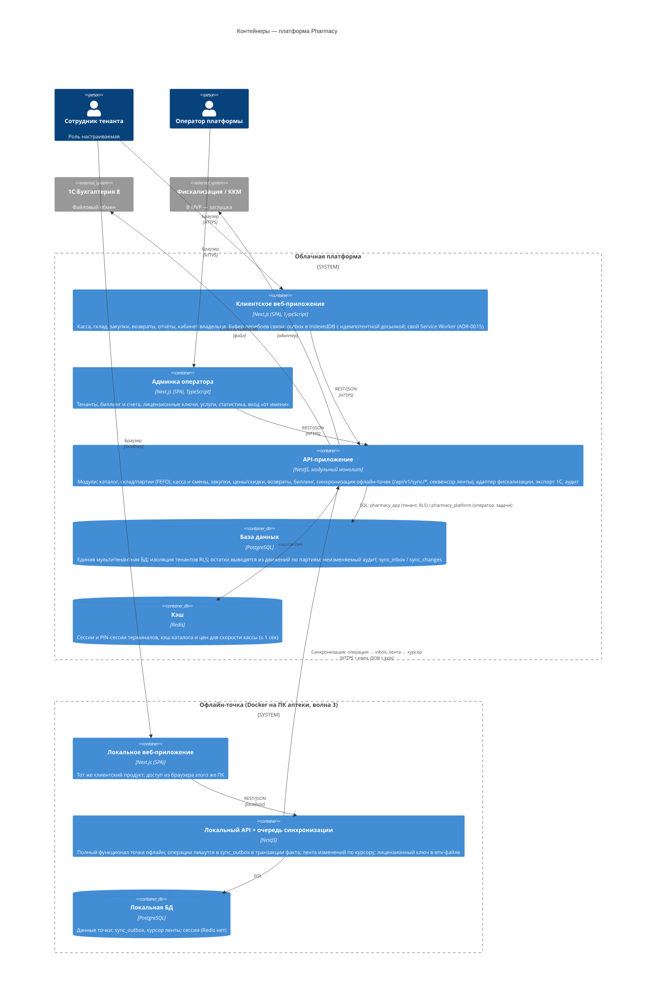

# C4 — Уровень 2: Контейнеры

Технологии — строго из docs/architecture/stack.md (раздел 3); выбор NestJS и Next.js —
ADR-0003, ADR-0004.

## Легенда

- **Кодовая база** — Nx-монорепо в репозитории `pharmacy` (ADR-0010): `apps/api`, `apps/web`, `apps/admin`,
  `libs/*` (общие типы, DTO, доменная логика, UI-кит). Офлайн-дистрибутив собирается из тех же
  `apps/web` + `apps/api`, отдельного кода точки нет.
- **API один на оба продукта**: клиентский и административный интерфейсы работают с единой
  мультитенантной моделью данных (ADR-0002).
- **Два пути доступа API к БД** (ADR-0013): tenant-путь — роль `pharmacy_app` (`TenantDatabase`, RLS по
  `app.tenant_id` на транзакцию); platform-путь — роль `pharmacy_platform` без BYPASSRLS (`PlatformDatabase`,
  только `app/platform/**` и `app/sync/**`) — платформенные таблицы, витрины тенантов и резолверы
  SECURITY DEFINER (владелец — NOLOGIN-роль `pharmacy_resolver`). Миграции — роль `pharmacy_owner`
  (сервис `migrate`).
- **Message-брокер отсутствует намеренно** (ADR-0002): в стеке не выбран, вводится только через ADR;
  очереди — таблицы PostgreSQL.
- **Синхронизация офлайн-точек** (ADR-0014): точка пишет операции-факты в `sync_outbox` в одной
  транзакции с фактом и отправляет батчами (`POST /api/v1/sync/operations`, ≤ 500 операций / ≤ 2 МБ);
  облако применяет каждую один раз (`sync_inbox`, неприменимые — в карантин). Обратно — лента
  `sync_changes` с номерами от секвенсора, точка забирает её по курсору (`GET /api/v1/sync/changes`).
  Ключ точки — в env-файле её развёртывания. Перевод точки в офлайн — флеш-комплект с переносящими
  движениями; с момента выпуска точка в режиме `offline-pending`.
- **Буфер перебоев связи** облачной точки (ТЗ «Административный продукт», п. 4.5) — часть
  клиентского веб-приложения (ADR-0015: outbox в IndexedDB, UUIDv7-ключ идемпотентности, карантин
  вместо удаления), не отдельный контейнер; лицензионных ключей не требует.
- **Периферия рабочего места** (сканер штрих-кода USB HID, принтер чеков 58/80 мм через печать
  браузера) — оборудование клиентского устройства; при недостаточности печати браузера ТЗ
  допускает локальный «агент печати» — он появится на диаграмме, только если понадобится
  (решение по итогам W1-13).
- Redis на офлайн-точке не устанавливается — сессии хранятся в PostgreSQL точки (ADR-0008), кэш не нужен.

Готовое изображение: img/container.png
