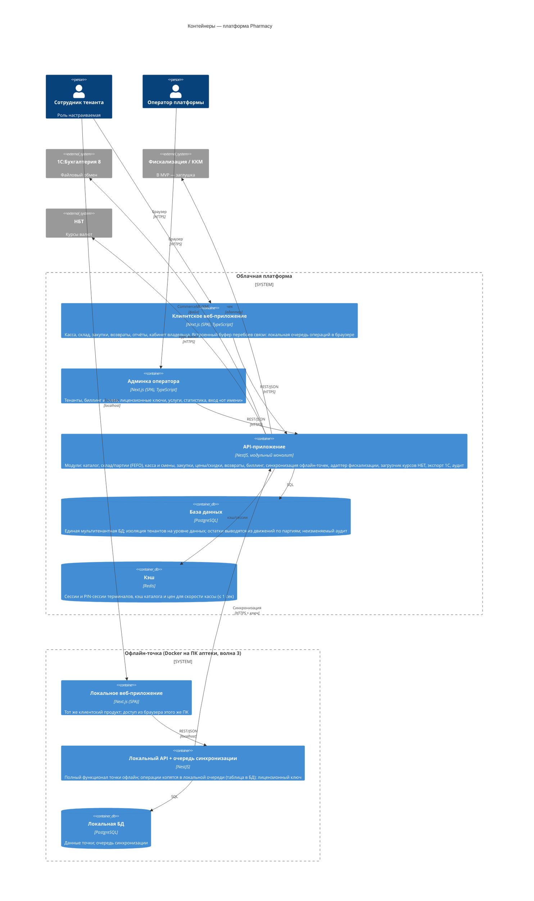

# C4 — Уровень 2: Контейнеры

Технологии — строго из docs/architecture/stack.md (раздел 3). NestJS и Next.js — в статусе
«ожидает исключения» (ADR-0003, ADR-0004); при отказе комитета по Next.js меняется только
подпись технологии фронтенд-контейнеров (React/Angular), структура неизменна.

## Легенда

- **Кодовая база** — Nx-монорепо `pharmacy-app`: `apps/api`, `apps/web`, `apps/admin`,
  `libs/*` (общие типы, DTO, доменная логика, UI-кит). Офлайн-дистрибутив собирается из тех же
  `apps/web` + `apps/api`, отдельного кода точки нет.
- **API один на оба продукта**: клиентский и административный интерфейсы работают с единой
  мультитенантной моделью данных (решение зафиксировано на шаге 1, будет отражено в ADR-0002).
- **Message-брокер отсутствует намеренно**: категория радара «Брокеры сообщений» не утверждена;
  очередь синхронизации офлайн-точек — таблица в PostgreSQL (локально на точке и в облаке).
- **Буфер перебоев связи** облачной точки (ТЗ «Административный продукт», п. 4.5) — часть
  клиентского веб-приложения (локальное хранилище браузера), не отдельный контейнер;
  лицензионных ключей не требует.
- **Периферия рабочего места** (сканер штрих-кода USB HID, принтер чеков 58/80 мм через печать
  браузера) — оборудование клиентского устройства; при недостаточности печати браузера ТЗ
  допускает локальный «агент печати» — он появится на диаграмме, только если понадобится
  (решение по итогам W1-13).
- Redis на офлайн-точке не устанавливается — сессии локальны, кэш не нужен.

Готовое изображение: img/container.png
