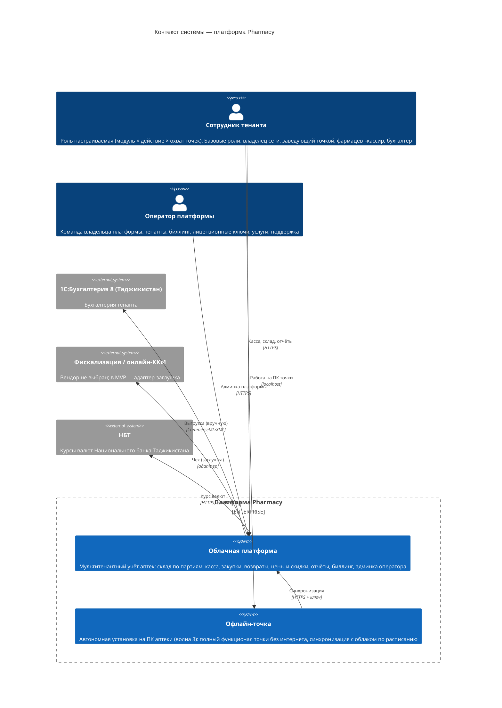

# C4 — Уровень 1: Контекст системы

Проект: Pharmacy — SaaS-платформа автоматизации сети аптек.
Основание: docs/architecture/stack.md; ТЗ «Клиентский продукт» v3.1, «Административный продукт» v2.1.

## Легенда

- **Сотрудник тенанта** — единый актор с настраиваемой ролью: система прав «модуль × действие ×
  охват точек» позволяет создавать произвольные роли; базовый набор (владелец, заведующий,
  кассир, бухгалтер) — отправная точка, не ограничение.
- **Синхронизация** офлайн-точки: очередь операций отправляется в облако (идемпотентно, без
  дублей), справочники и цены подтягиваются из облака; активация и блокировка — лицензионным
  ключом точки; расписание по умолчанию раз в сутки + ручной запуск.
- **Облачная платформа** и **офлайн-точка** — одна система (общая кодовая база, Nx-монорепо
  `pharmacy-app`); офлайн-точка — её автономная инсталляция на ПК аптеки (Docker, ADR-0005).
- **Банковский терминал эквайринга** на диаграмме отсутствует намеренно: по ТЗ интеграции нет —
  кассир проводит оплату на терминале банка-эквайера вручную и отмечает способ оплаты в чеке;
  сверка — вручную по итогам смены.
- Розничный покупатель не является пользователем системы (анонимен), поэтому как актор не показан.
- Продукт не связан с инфраструктурой Банка Эсхата — внешних банковских систем нет;
  банковским является только процесс проектирования (техрадар, Архитектурный комитет).

Готовое изображение: img/context.png
