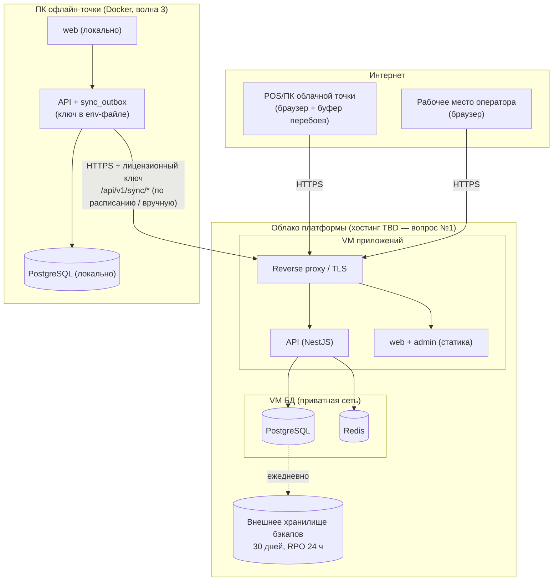

# C4 — Уровень: Размещение (Deployment)

Продукт разворачивается в собственном облачном окружении платформы. Место хостинга — открытый вопрос № 1 (юридическая проверка локализации
ПДн в Таджикистане) и должно быть решено до развёртывания прод-среды волны 1.

Способ запуска процессов: Docker Compose (ADR-0005).

## Серверные контейнеры (облако, хостинг TBD)

| Контейнер | Среда | Контур сети | Примечание |
|---|---|---|---|
| Reverse proxy / TLS-терминация | VM приложений | Публичная зона (единственная точка входа, HTTPS) | Отдаёт статику web/admin, проксирует /api на тот же origin (cookie сессии, ADR-0008). Требования ADR-0015 (выбор proxy — ADR-0012, proposed): маршруты-экраны по `try_files $uri $uri.html $uri/ =404` без SPA-fallback; `/_next/static/*` — `immutable`; HTML, `*.txt` и `sw.js` — `no-cache` |
| Клиентское веб-приложение (Next.js) | VM приложений | Публичная (через proxy) | Статическая сборка |
| Админка оператора (Next.js) | VM приложений | Публичная (через proxy) | Статическая сборка; отдельный поддомен |
| API (NestJS) | VM приложений | Приватная сеть (только за proxy) | Stateless (сессии в Redis) → масштабирование добавлением VM приложений (запас ×5) |
| PostgreSQL | VM БД | Только приватная сеть, снаружи недоступна | Ежедневный бэкап во внешнее хранилище, копии 30 дней; RPO 24 ч / RTO 4 ч |
| Redis | VM БД | Только приватная сеть | Потеря допустима (кэш/сессии) |

Среды: **prod** и **test** (тестовая база заказчика — обязательна для приёмки, см. бэклог
W2-05); одинаковая топология, меньшие ресурсы у test.

## Офлайн-точка (распределённая установка на оборудовании тенанта)

Не серверный и не «store-distributed» тип — собственный канал поставки платформы:

| Параметр | Значение |
|---|---|
| Узел | Один ПК точки: 64-бит ОС с Docker (Windows 10/11 + WSL2, Linux), ≥ 8 ГБ ОЗУ |
| Состав | Docker-образы: локальные web + API + PostgreSQL; автозапуск при загрузке ПК |
| Канал поставки | Установка оператором платформы: через интернет (снимки наборов `GET /api/v1/sync/snapshots/*`) или автономный флеш-комплект (образ + снимок облачных наборов на курсоре + партии с переносящими движениями, ADR-0014). С выпуска комплекта облако переводит точку в `offline-pending`: складская запись в облаке закрыта |
| Активация | Уникальный лицензионный ключ точки (выдаёт оператор; срок гибкий; отзыв — при следующей синхронизации); хранится в env-файле развёртывания точки |
| Конфигурация | Compose-профиль офлайн-точки: без Redis, `STORE_MODE=offline`, `SYNC_BASE_URL`, ключ и pepper точки в env-файле (ADR-0008, ADR-0014; профиль ещё не создан) |
| Обновление | Вручную оператором через удалённый доступ (TeamViewer/AnyDesk) при наличии интернета; облако поддерживает ≥ 2 предыдущие версии протокола синхронизации (преобразование операций на лету, ADR-0014) |
| Ответственность за данные | Несинхронизированные данные существуют только на ПК точки; ответственность тенанта (фиксируется в договоре); локальный бэкап — вне MVP |

## Клиентские устройства (без деплоя)

| Устройство | Что на нём | Примечание |
|---|---|---|
| POS-терминал / ПК облачной точки | Браузер (Chrome/Edge, последние 2 версии), сенсорный экран от 10″ | Буфер перебоев связи в браузере; сканер штрих-кода USB HID; принтер чеков 58/80 мм через печать браузера |
| ПК офлайн-точки | Браузер → localhost | Тот же ПК, где стоит Docker-дистрибутив |
| Рабочее место оператора | Браузер → админка | |

## Схема

Готовое изображение: img/deployment.png
