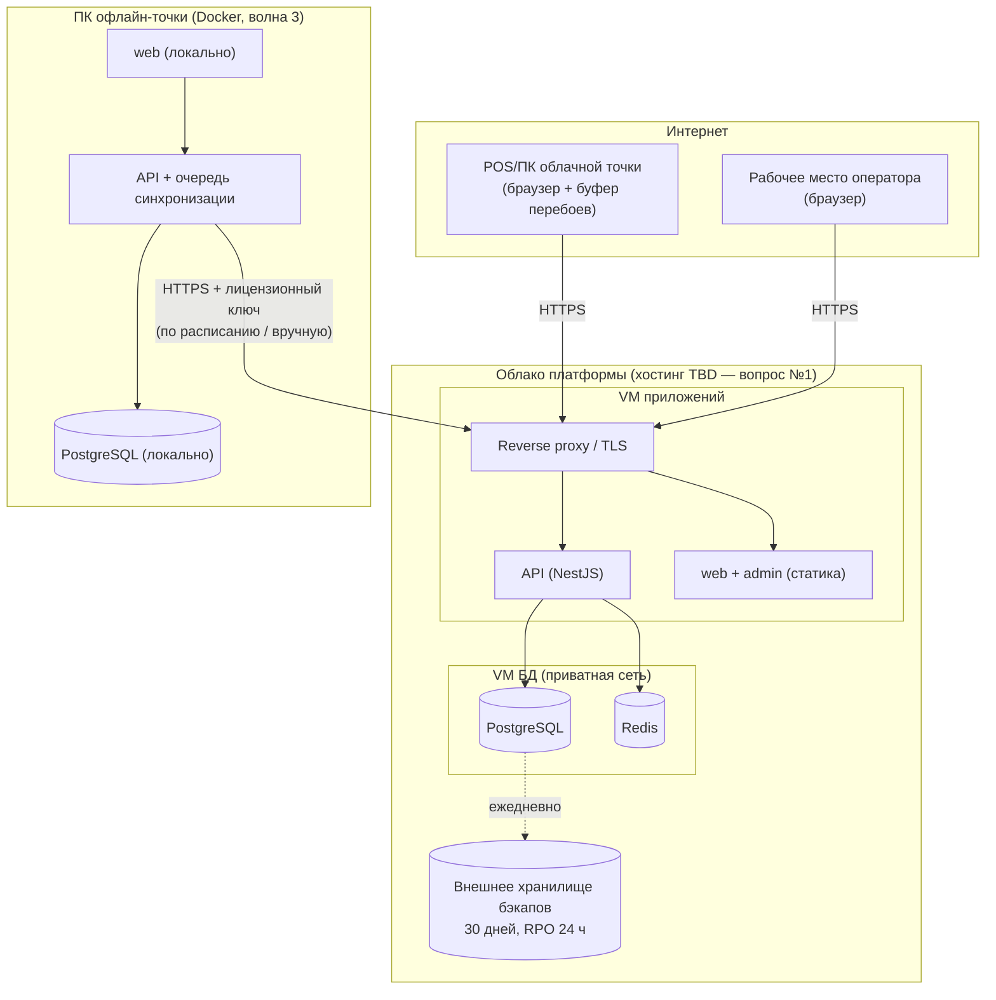

# C4 — Уровень: Размещение (Deployment)

Продукт не связан с инфраструктурой Банка Эсхата: разворачивается в собственном облачном
окружении платформы. Место хостинга — открытый вопрос № 1 (юридическая проверка локализации
ПДн в Таджикистане) и должно быть решено до развёртывания прод-среды волны 1.

Способ запуска процессов: после утверждения ADR-0005 — Docker Compose; до утверждения —
системные службы ОС. Структура размещения от этого не меняется.

## Серверные контейнеры (облако, хостинг TBD)

| Контейнер | Среда | Контур сети | Примечание |
|---|---|---|---|
| Reverse proxy / TLS-терминация | VM приложений | Публичная зона (единственная точка входа, HTTPS) | Отдаёт статику web/admin, проксирует /api |
| Клиентское веб-приложение (Next.js) | VM приложений | Публичная (через proxy) | Статическая сборка |
| Админка оператора (Next.js) | VM приложений | Публичная (через proxy) | Статическая сборка; отдельный поддомен |
| API (NestJS) | VM приложений | Приватная сеть (только за proxy) | Stateless (сессии в Redis) → масштабирование добавлением VM приложений (запас ×5) |
| PostgreSQL | VM БД | Только приватная сеть, снаружи недоступна | Ежедневный бэкап во внешнее хранилище, копии 30 дней; RPO 24 ч / RTO 4 ч |
| Redis | VM БД | Только приватная сеть | Потеря допустима (кэш/сессии) |

Среды: **prod** и **test** (тестовая база заказчика — обязательна для приёмки, см. бэклог
W2-05); одинаковая топология, меньшие ресурсы у test.

## Офлайн-точка (распределённая установка на оборудовании тенанта)

Не серверный и не «store-distributed» тип — собственный канал поставки платформы:

| Параметр | Значение |
|---|---|
| Узел | Один ПК точки: 64-бит ОС с Docker (Windows 10/11 + WSL2, Linux), ≥ 8 ГБ ОЗУ |
| Состав | Docker-образы: локальные web + API + PostgreSQL; автозапуск при загрузке ПК |
| Канал поставки | Установка оператором платформы: через интернет или автономный флеш-комплект (образ + снимок каталога и стартовых остатков) |
| Активация | Уникальный лицензионный ключ точки (выдаёт оператор; срок гибкий; отзыв — при следующей синхронизации) |
| Обновление | Вручную оператором через удалённый доступ (TeamViewer/AnyDesk) при наличии интернета; облако принимает синхронизацию от старых версий (преобразование на лету) |
| Ответственность за данные | Несинхронизированные данные существуют только на ПК точки; ответственность тенанта (фиксируется в договоре); локальный бэкап — вне MVP |

## Клиентские устройства (без деплоя)

| Устройство | Что на нём | Примечание |
|---|---|---|
| POS-терминал / ПК облачной точки | Браузер (Chrome/Edge, последние 2 версии), сенсорный экран от 10″ | Буфер перебоев связи в браузере; сканер штрих-кода USB HID; принтер чеков 58/80 мм через печать браузера |
| ПК офлайн-точки | Браузер → localhost | Тот же ПК, где стоит Docker-дистрибутив |
| Рабочее место оператора | Браузер → админка | |

## Схема

Готовое изображение: img/deployment.png
