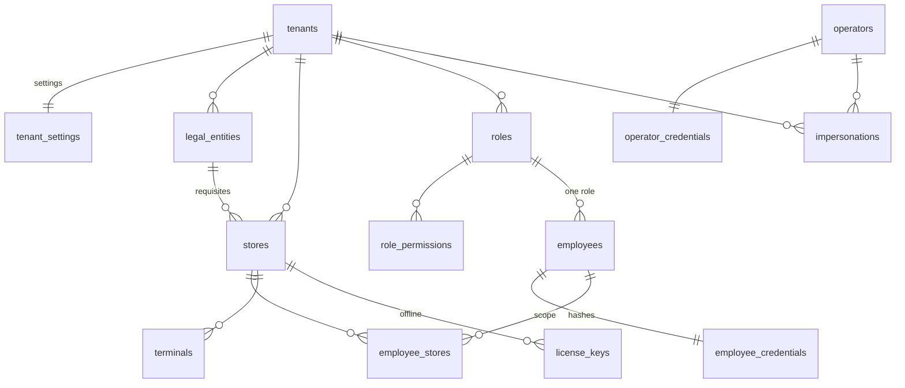

# 1. Платформа и организация сети

Соглашения (ключи, типы, архивирование) — в [README](README.md). У каждой таблицы класса `tenant` есть `tenant_id`, первичный ключ `(tenant_id, id)` и `created_at` — в списках колонок они не повторяются.

## `tenants` — сеть (класс `platform`)

Создаёт оператор (АП 2). Тенант видит только свою строку (политика `FOR SELECT TO pharmacy_app`). Синхронизация: облако → точка, своя строка.

| Колонка | Тип | Правило |
|---|---|---|
| `id` | uuid PK | |
| `code` | text unique | Код сети: `^[a-z0-9-]{3,32}$`. Во входе не участвует (сеть определяется по идентификатору сотрудника, поправка 2026-10-02) |
| `name` | text | Название сети |
| `status` | text | `active` / `blocked` (АП 2, 6). Заблокированный тенант не входит, данные сохраняются |
| `billing_name`, `billing_tax_id`, `billing_address`, `billing_phone`, `billing_email` | text null | Реквизиты для счёта платформы отдельными полями; ИНН — проверка формата в приложении (решение 2026-10-01) |
| `billing_bank_details` | text null | Банковские реквизиты одним текстом |
| `city` | text | Город сети (модуль «сети», 2026-10-05) |
| `owner_full_name`, `owner_login`, `owner_phone`, `owner_email` | text null | Контакт владельца для платформы; пишет `provision_tenant` при создании сети (ADR-0013, поправка 2026-10-05) — `employees` платформа не читает |
| `blocked_at`, `blocked_by`, `block_reason` | null | Блокировка оператором: заданы вместе и только у `blocked` (`blocked_by` — оператор, без FK) |
| `created_at`, `updated_at` | timestamptz | |

ИНН (`billing_tax_id`) уникален среди сетей (`tenants_inn_uq`). Сеть с её владельцем создаёт только
функция `provision_tenant`, новый код владельцу — `issue_owner_code` (SECURITY DEFINER, владелец
`pharmacy_provisioner`, вызывает `pharmacy_platform`). Вместе с ролью «Владелец» функция создаёт три
обычные роли сети — «Заведующий точкой», «Фармацевт-кассир», «Бухгалтер» — с правами по умолчанию из
`roleTemplates` (`template_key` пустой; ADR-0013, поправка 2026-10-05, п. 6).

## `tenant_settings` — настройки сети (класс `tenant`, одна строка на тенанта)

Первичный ключ — `tenant_id`. Синхронизация: облако → точка.

| Колонка | Тип | По умолчанию | Источник |
|---|---|---|---|
| `default_language` | text `ru`/`tj` | `ru` | Обязательный язык названий (D6), язык чека |
| `timezone` | text | `Asia/Dushanbe` | Бизнес-дата |
| `return_period_days` | integer ≥ 0 | 14 | КП 7 |
| `cashier_session_idle_min` | integer | 15 | КП 12; ограничения — ADR-0008 |
| `pin_min_length` | integer ≥ 4 | 4 | ADR-0008 |
| `sync_interval_min` | integer 5…1440 | 15 | ADR-0014 |
| `receipt_footer` | jsonb null | | Текст внизу чека по языкам (КП 5) |
| `expiry_reminder_days` | integer | 30 | БЛ W1-17 |
| `supplier_payment_reminder_days` | integer | 3 | БЛ W2-02 |
| `piece_price_rounding_dirams` | integer ≥ 1 | 10 | Шаг округления вверх расчётной цены штуки (решение 2026-09-30) |
| `backdating_max_days` | integer ≥ 0 | 30 | На сколько дней назад можно поставить дату документа (решение 2026-10-01) |
| `prescription_retention_days` | integer 1…3650 | 90 | Срок хранения данных рецептов ПКУ (решение 2026-09-30; подтвердить с юристом) |
| `updated_at`, `updated_by` | | | |

## `legal_entities` — юрлица сети (класс `tenant`, D5)

Синхронизация: облако → точка.

| Колонка | Тип | Правило |
|---|---|---|
| `name` | text | Полное название юрлица / ИП для чека |
| `tax_id` | text | ИНН; уникален в `(tenant_id, tax_id)` среди активных |
| `legal_address` | text | |
| `phone`, `email` | text null | |
| `bank_details` | text null | Банковские реквизиты одним текстом (решение 2026-10-01) |
| `closed_until` | date null | Закрытый период (решение 2026-10-01): документы точек этого юрлица с датой ≤ `closed_until` нельзя проводить и отменять. Закрывает вручную владелец или бухгалтер, обычно после выгрузки в 1С; каждое изменение — в `audit_log` |
| `closed_until_set_by`, `closed_until_set_at` | null | |
| `status`, `archived_at` | text / timestamptz | `active` / `archived` |

## `stores` — точка (класс `tenant`)

Создаёт и закрывает владелец (ADR-0013). Реестр без адреса видит платформа: колонки `id, tenant_id, name, mode, status, created_at, closed_at`. Режим меняет оператор (`UPDATE (mode)`). Синхронизация: облако → точка.

| Колонка | Тип | Правило |
|---|---|---|
| `legal_entity_id` | uuid | → `legal_entities` |
| `name` | text | |
| `code` | text | Короткий код точки для номеров документов (`01`, `DSH1`): шаблон `^[A-Z0-9]{1,8}$`, уникален в `(tenant_id, code)`; задаёт владелец (решение 2026-09-30) |
| `address` | text | Фактический адрес для чека |
| `kind` | text | `pharmacy` / `warehouse` (решение 2026-10-01): склад пока не продаёт — терминалы и смены для него запрещает приложение, а не база, чтобы позже разрешить розницу без миграции; в биллинг не входит; может быть офлайн-точкой |
| `mode` | text | `online` / `offline_pending` / `offline`. `offline_pending`: выпущен флеш-комплект, запись склада в облаке закрыта (ADR-0014 §4) |
| `status` | text | `active` / `closed`. «Ожидает активации» в макете — это `mode = 'offline_pending'` |
| `print_receipt_default` | boolean | true (КП 5) |
| `closed_at` | timestamptz null | Обязателен при `status = 'closed'` |
| `idempotency_key` | uuid null | Ключ повтора создания точки (заголовок `Idempotency-Key`, спецификация 2026-10-06-owner-stores); уникален в сети, если задан |

Ключи и индексы: `unique (tenant_id, id)` — цель составных ссылок; `(tenant_id, legal_entity_id)`.

## `employees` — сотрудник (класс `tenant`)

Синхронизация: облако → точка, **без** `employee_credentials`.

| Колонка | Тип | Правило |
|---|---|---|
| `role_id` | uuid | → `roles`; одна роль (ADR-0018) |
| `login` | text | Глобально уникален: `lower(login)` на всей платформе (вход по логину, телефону или e-mail; поправка 2026-10-02) |
| `full_name` | text | |
| `employee_code` | text null | Табельный код для выбора кассира на терминале; уникален в тенанте |
| `phone` | text null | E.164 (`check` формата); глобально уникален среди заданных; идентификатор входа. Вопрос 9 разбора ТЗ: нужен для доставки ключа по SMS |
| `email` | text null | Глобально уникален: `lower(email)` среди заданных; идентификатор входа (поправка 2026-10-02) |
| `language` | text null | `ru` / `tj`; пусто — язык сети |
| `store_scope` | text | `all` / `list`; при `list` точки — в `employee_stores` |
| `status` | text | `active` / `blocked` / `archived` |
| `permissions_version` | bigint default 1 | Растёт при изменении роли, прав, охвата или блокировке (ADR-0018 п. 7) |
| `last_login_at` | timestamptz null | Время последнего успешного входа; показывается в `GET /me` (поправка 2026-10-02) |
| `updated_at` | | |

## `employee_credentials` — учётные данные (класс `tenant`)

Первичный ключ `(tenant_id, employee_id)`. **Не синхронизируется**: на офлайн-точке учётные данные свои (ADR-0008). Отдельная таблица, чтобы хеши не попадали в ленту и обычные выборки сотрудников.

| Колонка | Тип | Правило |
|---|---|---|
| `password_hash` | text null | PHC-строка scrypt (ADR-0008); пусто — вход только по одноразовому коду |
| `password_pepper_version` | integer null | |
| `password_changed_at` | timestamptz null | |
| `pin_hash`, `pin_pepper_version` | text / integer null | |
| `pin_failed_attempts` | integer default 0 | После 3 — блокировка PIN |
| `pin_locked_at` | timestamptz null | |
| `one_time_code_hash`, `one_time_code_expires_at` | text / timestamptz null | Код активации владельца, первый вход на офлайн-точке и сброс пароля. Код — 128 бит из `randomBytes`; хранится hex SHA-256 (не scrypt и без pepper, поправка 2026-10-02); срок — `ACTIVATION_CODE_TTL_HOURS` |
| `updated_at` | | |

## `roles`, `role_permissions`, `employee_stores` (класс `tenant`, ADR-0018)

Синхронизация: облако → точка.

- **`roles`:** `name jsonb` (D6), `is_owner boolean` — одна роль-владелец на тенанта (уникальный частичный индекс), `template_key text null` — шаблон, из которого создана роль (`owner` / `manager` / `cashier` / `accountant`, ключи `RoleTemplateKey` в `libs/shared/domain`; у своих ролей — null), `status`.
- **`role_permissions`:** ключ `(tenant_id, role_id, permission)`, `permission text` по шаблону `^[a-z0-9-]+:[a-z0-9-]+$`. Каталог прав — в коде `libs/shared/domain`, проверка допустимости — в приложении.
- **`employee_stores`:** ключ `(tenant_id, employee_id, store_id)`, обе ссылки составные.

## `terminals` — касса (класс `tenant`, ADR-0008)

Синхронизация: терминалами офлайн-точки владеет точка (`terminal.bound` / `terminal.revoked` → облако).

| Колонка | Тип | Правило |
|---|---|---|
| `store_id` | uuid | Точка `kind = 'pharmacy'` |
| `name` | text | Уникально в точке |
| `credential_hash` | bytea | SHA-256 device-credential; уникален |
| `bound_by`, `bound_at` | uuid / timestamptz | |
| `last_seen_at` | timestamptz null | |
| `revoked_at`, `revoked_by` | null | Отзыв действует немедленно |

## `operators`, `operator_credentials` (класс `platform`)

- **`operators`:** `login` unique, `full_name`, `status` `active` / `blocked`. В MVP одна роль с полным доступом (АП 6), права оператора — в коде.
- **`operator_credentials`:** хеш пароля и версия pepper, как у сотрудника.

## `impersonations` — вход «от имени» (класс `platform`, ADR-0008 E2)

> **Отложено** (поправка ADR-0008 от 2026-10-05): в MVP вход «от имени» не реализуется, таблица не
> создаётся. Её состав пересматривается вместе с доступом по разрешению владельца (уровень, срок,
> отзыв) отдельной поправкой ADR.

| Колонка | Тип | Правило |
|---|---|---|
| `operator_id`, `tenant_id` | uuid | |
| `reason` | text | Обязательна |
| `started_at`, `expires_at`, `ended_at` | timestamptz | TTL ≤ 60 мин, без продления |

Владелец видит факт входа в `audit_log` своего тенанта, каждая запись которого несёт `impersonation_id`.

## `license_keys` — ключ офлайн-точки (класс `platform`, ADR-0013, ADR-0014 §6–7)

Тенант читает ключи своих точек. Резолвер `resolve_license_key` читает колонки `key_hash, tenant_id, store_id, status, valid_until`.

| Колонка | Тип | Правило |
|---|---|---|
| `key_id` | text unique | Открытая часть `phk_<keyId>_<secret>` |
| `key_hash` | bytea unique | SHA-256 секрета |
| `tenant_id`, `store_id` | uuid | → `stores (tenant_id, id)` |
| `valid_until` | timestamptz | |
| `notify_before_days` | integer default 7 | АП 4.3 |
| `status` | text | `active` / `revoked` / `revoked_hard`; «истекает» и «истёк» вычисляются из `valid_until` |
| `issued_by`, `issued_at`, `revoked_by`, `revoked_at` | | |
| `replaces_key_id` | uuid null | Ротация: старый действует до первого прогона с новым |

У точки не больше одного ключа `active` (уникальный частичный индекс по `(tenant_id, store_id)`).

## Поправка 2026-10-02 (аутентификация)

Решения архитектора по спецификации `docs/superpowers/specs/2026-10-02-auth-design.md` (ADR-0008 и ADR-0013, поправки той же даты); миграции — в части 1 реализации.

- **Вход по глобально уникальному идентификатору.** `employees.login`, `phone` (E.164) и `email` уникальны на всей платформе (`lower(login)`, `phone`, `lower(email)`); индекс `employees_login_uq (tenant_id, lower(login))` заменяется глобальными. Сеть при входе определяет резолвер `resolve_login(kind, value)`; `tenants.code` во входе не участвует.
- Новые колонки `employees.email`, `employees.last_login_at`, `roles.template_key`.
- Одноразовый код (`employee_credentials.one_time_code_hash`) — hex SHA-256 от 128 бит `randomBytes`.
