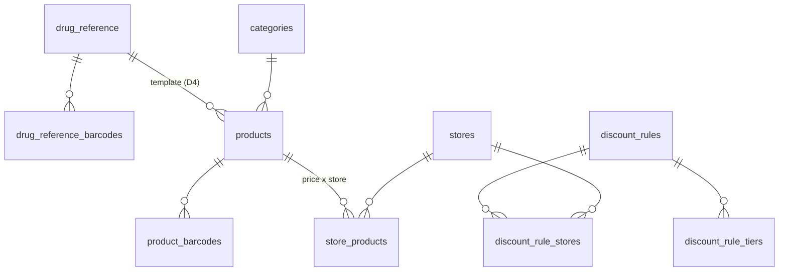

# 2. Каталог и цены

Соглашения — в [README](README.md). `tenant_id`, `(tenant_id, id)` и `created_at` в списках колонок не повторяются.

> **Введено миграцией `catalog-pricing` (2026-10-07, спецификация `docs/superpowers/specs/2026-10-07-catalog-pricing-design.md`):**
> `categories`, `dictionary_values`, `products`, `product_barcodes`, `store_products`, `discount_rules`,
> `discount_rule_tiers`, `discount_rule_stores` — только колонки, у которых есть потребитель. Колонки синхронизации,
> справочника препаратов, прихода и склада (`products.origin`, `created_at_store_id`, `merged_into_product_id`,
> `drug_reference_id`, `store_products.draft_*`, `min_stock_pieces`) добавят миграции своих модулей; `drug_reference`
> и `payment_methods` — тоже. Решения при реализации:
> - розничная цена есть только у пары «товар × точка» (подтверждено 2026-10-07): цены сети нет, экран «Цены» задаёт
>   цену нескольким точкам одним запросом;
> - `products.unit` — закрытый список кодов `pack` / `piece` / `ml` (`productUnits`, `libs/shared/domain`), строк
>   справочника для единиц нет;
> - МНН в контракте — одна строка, хранится как `{"ru": …}` (индекс аналогов — по `inn->>'ru'`);
> - стартовые категории и лекарственные формы новой сети создаёт `provision_tenant` (ADR-0013, поправка 2026-10-05, п. 7).

## `drug_reference`, `drug_reference_barcodes` — общий справочник (класс `shared`, ADR-0013)

Ведёт оператор (`pharmacy_platform`), читают все тенанты. Синхронизация: облако → точка.

| Колонка | Тип | Правило |
|---|---|---|
| `id` | uuid PK | |
| `name` | jsonb | D6 |
| `inn` | jsonb | МНН по языкам |
| `dosage_form`, `dosage`, `manufacturer`, `country` | text | |
| `is_prescription`, `is_controlled` | boolean | Рекомендуемые значения; действующие — в карточке товара (D4) |
| `status` | text | `active` / `archived` |
| `updated_at` | timestamptz | По нему владелец видит «в справочнике есть обновление» |

`drug_reference_barcodes`: `(drug_reference_id, barcode)`, `barcode` уникален.

## `products` — карточка товара (класс `tenant`, D4)

Синхронизация: облако → точка. Товары, заведённые на офлайн-точке, — точка → облако (`product.created-locally`).

| Колонка | Тип | Правило |
|---|---|---|
| `name` | jsonb | D6; индексы `pg_trgm` по `name->>'ru'` и `name->>'tj'` |
| `inn` | jsonb null | МНН; индекс по `lower(inn->>'ru')` для поиска аналогов |
| `dosage_form`, `dosage`, `manufacturer`, `country` | text null | Форма — название из `dictionary_values` на языке сети; производитель — свободный текст; страна — ISO 3166-1 alpha-2 |
| `unit` | text | `pack` / `piece` / `ml` (check) |
| `pieces_per_pack` | integer ≥ 1 | 1 — не делится |
| `sold_by_piece` | boolean | Разрешена поштучная продажа — включается для каждого товара отдельно; при `pieces_per_pack = 1` — false |
| `is_prescription`, `is_controlled` | boolean | Рецептурный — предупреждение; ПКУ — право `pos:sell-controlled` и рецепт |
| `is_price_regulated` | boolean | |
| `max_retail_price_per_pack_dirams` | bigint null | Обязателен при `is_price_regulated` |
| `category_id` | uuid null | → `categories` |
| `markup_bp` | integer null | Пусто — наценка категории |
| `default_min_stock_pieces` | integer null | Минимальный остаток по умолчанию для всех точек (решение 2026-10-01) |
| `article` | text null | Для сопоставления с 1С; уникален в тенанте, если задан |
| `drug_reference_id` | uuid null | → `drug_reference` |
| `origin` | text | `cloud` / `local` |
| `created_at_store_id` | uuid null | Точка, где товар заведён локально |
| `merged_into_product_id` | uuid null | После решения по дублю (ADR-0014 §4): алиас на облачную карточку; факты не переписываются |
| `status`, `archived_at` | | `active` / `archived` / `merged` |
| `updated_at` | | |

## `product_barcodes` (класс `tenant`)

Ключ `(tenant_id, barcode)`: штрихкод уникален в сети, скан находит одну карточку (БЛ W1-04). Колонка `product_id`, индекс `(tenant_id, product_id)`. Синхронизация: облако → точка. Если офлайн-товар пришёл с уже занятым штрихкодом, штрихкод не вставляется, а ждёт в `sync_conflicts` (`duplicate_product`).

## `categories` (класс `tenant`)

Плоский список: `name jsonb`, `markup_bp integer null`, `pos_sort_order integer`, `status`. Синхронизация: облако → точка.

## `dictionary_values` — списки значений (класс `tenant`)

| Колонка | Тип | Правило |
|---|---|---|
| `kind` | text | Сейчас `dosage_form`; `write_off_reason`, `customer_return_reason` добавят модули склада и возвратов (check расширяется миграцией) |
| `code` | text null | У системных значений — стабильный код (например, `write_off_reason.expired`); уникален в `(tenant_id, kind, code)` |
| `name` | jsonb | D6 |
| `is_system` | boolean | Стартовый набор, не удаляется |
| `status` | text | |

Синхронизация: облако → точка (уточнить в ADR-0014).

## `payment_methods` (класс `tenant`)

`kind text` — `cash` / `card` / `qr` / `nfc`; `name jsonb` (например, «QR Алиф»), `is_system`, `status`, `pos_sort_order`. Системный `cash` всегда один и не архивируется: от него считается сдача. Синхронизация: облако → точка.

## `store_products` — товар × точка (класс `tenant`)

Ключ `(tenant_id, store_id, product_id)` — правило «цена уникальна для пары товар × точка» (БЛ 6.2).

| Колонка | Тип | Правило |
|---|---|---|
| `retail_price_per_pack_dirams` | bigint null | Пусто — товар на точке не продаётся |
| `retail_price_per_piece_dirams` | bigint null | Своя цена штуки (решение 2026-09-30). Пусто — `ceil(цена упаковки / pieces_per_pack)` до шага `tenant_settings.piece_price_rounding_dirams`. Имеет смысл только при `products.sold_by_piece` |
| `price_version` | integer | Растёт при каждом изменении; основа конфликта цен (ADR-0014) |
| `price_changed_at`, `price_changed_by`, `price_source` | | `cloud` / `store` (локальное изменение офлайн-точки) |
| `draft_price_per_pack_dirams` | bigint null | Черновик после прихода по наценке (КП 6.1); применяется подтверждением |
| `draft_source_document_id` | uuid null | Приход, который предложил цену |
| `min_stock_pieces` | integer null | Переопределение для точки; пусто — `products.default_min_stock_pieces`. Порог для «Мало на складе» и «заполнить по дефициту» |
| `updated_at` | | |

Синхронизация: цена сети — облако → точка; локальное изменение — точка → облако (`price.changed-locally`). Предупреждения «выше предельной» и «ниже закупочной» — в приложении, база их не блокирует. История цен — в `audit_log`.

## `discount_rules`, `discount_rule_tiers`, `discount_rule_stores` (класс `tenant`)

Синхронизация: облако → точка.

- **`discount_rules`:**
  - `name jsonb`;
  - `level` — `network` / `store`;
  - `store_scope` — `all` / `list`;
  - `valid_from`, `valid_to` — `date null`: пусто — без ограничения;
  - `status` — `active` / `archived`, `created_by`.
- **`discount_rule_tiers`:** ключ `(tenant_id, rule_id, min_total_dirams)`, `percent_bp`. Порог «от 500 сомони — 3 %» = `min_total_dirams 50000`, `percent_bp 300`.
- **`discount_rule_stores`:** ключ `(tenant_id, rule_id, store_id)`.

Применяется одно правило с наибольшей выгодой, без суммирования (КП 6.2). Сработавшее правило и процент сохраняются в чеке.
