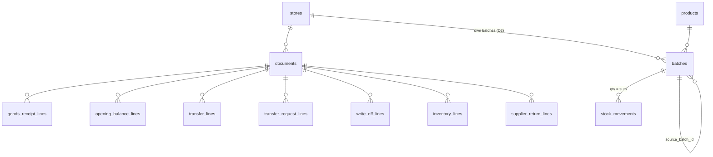

# 3. Партии и склад

Соглашения — в [README](README.md). `tenant_id`, `(tenant_id, id)` и `created_at` в списках колонок не повторяются. Все количества — в штуках (`_pieces`), деньги — в дирамах.

> **Введено миграцией `inventory-core` (2026-10-09, спецификация `docs/superpowers/specs/2026-10-09-inventory-purchasing-design.md`):**
> `document_counters`, `documents` (типы `goods_receipt`, `opening_balance`), `batches` (`origin` — те же два),
> `goods_receipt_lines`, `opening_balance_lines`, `stock_movements` (виды `goods_receipt`, `opening_balance`,
> `reversal`, `sale`). Остальные типы документов, строки и колонки (`source_batch_id`, `negative_flagged_at`,
> перемещения, списания, инвентаризация, возвраты поставщику, `purchase_order_*`) добавят миграции своих модулей.
> Решения при реализации:
> - **розница из прихода применяется при проведении** (поправка модели, утверждена архитектором 2026-10-09):
>   `goods_receipt_lines.retail_price_draft_dirams` — цена, которая при проведении становится ценой точки
>   (права на цены, предельная цена, `price.changed`); черновых цен `store_products.draft_*` нет;
> - у `opening_balance_lines` есть `lot_number` и необязательная розница `retail_price_draft_dirams`;
> - секции `stock_movements` созданы до 2028-12, дальше — плановая задача;
> - строка черновика, не изменённая после отмены проведения (товар, срок, серия, цена), сохраняет партию;
> - сторно (`reversal`) несёт дату документа как `business_date`;
> - закрытый период юрлица (`legal_entities.closed_until`) проверяется при проведении (422 `period_closed`).

## `batches` — партия (класс `tenant`, D2)

Партия принадлежит одной точке. **Количества в партии нет**: остаток = `sum(stock_movements.qty_delta_pieces)`. Синхронизация: партии офлайн-точки — точка → облако, внутри операций. Облако создаёт партии офлайн-точки только из этих операций.

| Колонка | Тип | Правило |
|---|---|---|
| `store_id`, `product_id` | uuid | |
| `expiry_date` | date | |
| `lot_number` | text null | Серия |
| `purchase_price_per_pack_dirams` | bigint ≥ 0 | |
| `cost_per_piece_dirams` | bigint ≥ 0 | `ceil(purchase / pieces_per_pack)` на момент создания |
| `supplier_id` | uuid null | |
| `origin` | text | `goods_receipt` / `opening_balance` / `transfer` / `inventory_surplus` |
| `source_document_id` | uuid | Создавший документ |
| `source_batch_id` | uuid null | Исходная партия отправителя (`origin = 'transfer'`) |
| `is_starting` | boolean | «Стартовая партия» без разбивки (КП 3.4) |
| `negative_flagged_at` | timestamptz null | Ушла в минус после синхронизации — нужна инвентаризация (БЛ W3-03) |

Индексы:
- `(tenant_id, store_id, product_id, expiry_date)` — FEFO на кассе и выбор партии;
- `(tenant_id, store_id, expiry_date)` — напоминания о сроках.

## `documents` — шапка складского документа (класс `tenant`, D1)

Синхронизация: проведённые документы офлайн-точки — точка → облако (`document.posted`); черновики не синхронизируются. Входящие перемещения на офлайн-точку — облако → точка («в пути»). Складские документы офлайн-точки из облака создавать нельзя (ADR-0014).

| Колонка | Тип | Правило |
|---|---|---|
| `store_id` | uuid | Точка документа (для перемещения — отправитель) |
| `type` | text | `goods_receipt`, `opening_balance`, `transfer`, `transfer_request`, `write_off`, `inventory`, `supplier_return` |
| `number` | text | Уникален в `(tenant_id, store_id, type, number)`; из `document_counters` |
| `document_date` | date | Дата документа; можно задним числом (КП 3.5), но не раньше чем `tenant_settings.backdating_max_days` дней от бизнес-даты и не в закрытом периоде `legal_entities.closed_until`. Проверяет приложение при проведении. Факты офлайн-точки, пришедшие с датой в закрытом периоде, облако принимает (продажа — факт) и показывает бухгалтеру как «после закрытия периода» |
| `status` | text | См. «Статусы» ниже |
| `created_by`, `posted_by`, `posted_at` | | |
| `unposted_by`, `unposted_at` | null | Последняя отмена проведения |
| `comment` | text null | |
| `total_dirams` | bigint null | Сумма документа при проведении (приход, возврат поставщику) |
| **Приход, возврат поставщику** | | |
| `supplier_id` | uuid null | Обязателен для `goods_receipt`, `supplier_return` |
| `supplier_invoice_number`, `supplier_invoice_date` | text / date null | Один приход = одна накладная |
| `payment_due_date` | date null | Срок оплаты: дата накладной + отсрочка поставщика |
| `purchase_order_id` | uuid null | → `purchase_orders` |
| `source_document_id` | uuid null | Возврат поставщику → исходный приход (необязательно) |
| `claim_text` | text null | Претензия поставщику |
| **Списание** | | |
| `source_customer_return_id` | uuid null | Автоматическое списание просроченного товара, возвращённого покупателем ([04](04-pos.md)) |
| **Перемещение, заявка** | | |
| `destination_store_id` | uuid null | Обязателен для `transfer`, `transfer_request`; ≠ `store_id` |
| `request_document_id` | uuid null | Перемещение по заявке |
| `dispatched_at`, `received_at`, `received_by` | null | |
| **Инвентаризация** | | |
| `inventory_scope` | text null | `all` / `category` / `selected` |
| `inventory_category_id` | uuid null | |
| `inventory_started_at` | timestamptz null | Момент снимка учётных остатков; касса продолжает работать |
| `updated_at` | | |

`check`: обязательные поля по `type`.

**Статусы:**
- **Обычный документ** (`goods_receipt`, `opening_balance`, `write_off`, `inventory`, `supplier_return`): `draft` → `posted`; отмена проведения — снова `draft`.
- **Перемещение:** `draft` → `in_transit` (отправлено: у отправителя сразу −N) → `received` (у получателя + факт).
- **Заявка:** `draft` → `sent` → `in_progress` → `partial` / `done` / `rejected`. На остатки не влияет.

## Строки документов

Ключ каждой — `(tenant_id, id)`. Ссылка на шапку — `(tenant_id, document_id)` с проверкой типа документа в приложении. Колонка `line_no` — порядок строк.

| Таблица | Колонки |
|---|---|
| `goods_receipt_lines` | `product_id`, `qty_pieces > 0`, `expiry_date`, `lot_number`, `purchase_price_per_pack_dirams`, `order_price_per_pack_dirams null` (для предупреждения «цена отличается от заказа»), `purchase_order_line_id null`, `batch_id` (создаётся при первом проведении, при повторном — та же), `retail_price_draft_dirams null` |
| `opening_balance_lines` | `product_id`, `qty_pieces > 0`, `expiry_date`, `purchase_price_per_pack_dirams`, `supplier_id null`, `batch_id`, `is_starting` |
| `transfer_lines` | `source_batch_id`, `qty_sent_pieces > 0`, `qty_received_pieces null` (при приёмке), `target_batch_id null` (партия получателя, D2), `discrepancy_resolution null` — `write_off` / `resend` |
| `transfer_request_lines` | `product_id`, `qty_requested_pieces > 0`. Выполненное количество — по связанным перемещениям |
| `write_off_lines` | `batch_id`, `qty_pieces > 0`, `reason_code` (из `dictionary_values`, `write_off_reason`) |
| `inventory_lines` | `product_id`, `batch_id null` (пусто — найден товар без учётной партии), `book_qty_pieces` (на момент начала), `counted_qty_pieces`, `sold_since_start_pieces` (при проведении), `surplus_expiry_date null`, `surplus_purchase_price_per_pack_dirams null`, `surplus_batch_id null`. Расхождение по строке с партией — движение `inventory_gain` / `inventory_loss` по этой партии. Строка без партии — новая партия `inventory_surplus`; срок и закупочную цену **вводит сотрудник** при проведении, без них документ не проводится (решение 2026-09-30) |
| `supplier_return_lines` | `batch_id`, `qty_pieces > 0`, `amount_dirams` |

## `stock_movements` — движение остатка (класс `tenant`, только добавление)

Месячные секции по `recorded_at`, ключ `(tenant_id, id, recorded_at)`.

| Колонка | Тип | Правило |
|---|---|---|
| `store_id`, `batch_id` | uuid | Точка партии |
| `qty_delta_pieces` | integer ≠ 0 | + приход, − расход |
| `kind` | text | `goods_receipt`, `opening_balance`, `transfer_out`, `transfer_in`, `write_off`, `inventory_gain`, `inventory_loss`, `supplier_return`, `sale`, `customer_return`, `reversal` |
| `source_type` | text | `document` / `receipt` / `customer_return` |
| `source_id`, `source_line_id` | uuid | Документ, чек или возврат и строка |
| `business_date` | date | Дата документа или продажи (для отчётов «на дату» и ПКУ) |
| `recorded_at` | timestamptz | Время записи |
| `origin` | text | `local` / `cloud_snapshot` (переносящие движения флеш-комплекта, ADR-0014 §4) |
| `reverses_movement_id` | uuid null | Для `reversal`; ссылку проверяет приложение (секционированная таблица) |

Индексы: `(tenant_id, store_id, batch_id) include (qty_delta_pieces)` — остаток партии без чтения таблицы; `(tenant_id, source_id)`; `(tenant_id, store_id, business_date)`.

Правила:
- **Операция и её движения** — одна транзакция.
- **Блокировка отдельно от подсчёта:** партии блокируются `FOR UPDATE` одним оператором, остаток считается следующим (ADR-0006 п. 2).
- **Минус запрещён** при продаже, отправке, списании и возврате поставщику. Исключение — факты офлайн-точки: облако их принимает и помечает партию `negative_flagged_at`.
- **Отмена проведения** — движения `reversal` с противоположным знаком. Отмена запрещена, если по партиям документа есть движения позже его проведения (БЛ 6.2).

## `document_counters` — нумерация (класс `tenant`)

Ключ `(tenant_id, store_id, kind, year)`, колонка `last_number bigint`. Счётчик свой на каждый год: внутри года номера только растут, 1 января начинаются с 1. `kind` — типы документов плюс `receipt`, `customer_return`, `z_report`, `purchase_order`. Номер берётся `INSERT … ON CONFLICT DO UPDATE … RETURNING` в транзакции документа; год — по бизнес-дате документа.

**Формат номера** (решение 2026-09-30): `<префикс>-<код точки>-<год>-<номер>`, номер дополняется нулями до 6 знаков (у чека — до 9, без префикса).

| Тип | Префикс | Пример |
|---|---|---|
| Приход | `ПР` | `ПР-01-2026-000123` |
| Перемещение | `ПМ` | `ПМ-01-2026-000017` |
| Заявка на перемещение | `ЗП` | `ЗП-01-2026-000012` |
| Списание | `СП` | `СП-01-2026-000009` |
| Инвентаризация | `ИН` | `ИН-01-2026-000003` |
| Возврат поставщику | `ВП` | `ВП-01-2026-000045` |
| Ввод начальных остатков | `НО` | `НО-01-2026-000001` |
| Заказ поставщику | `ЗК` | `ЗК-01-2026-000030` |
| Возврат покупателя | `ВЗ` | `ВЗ-01-2026-000210` |
| Z-отчёт | `Z` | `Z-01-2026-000087` |
| Чек | — | `01-2026-000001234` |

Префиксы — константы кода, а не колонка: при изменении префикса старые номера остаются как были.

Офлайн-точка нумерует свои документы сама, облако её счётчики не трогает, поэтому номера не пересекаются.
