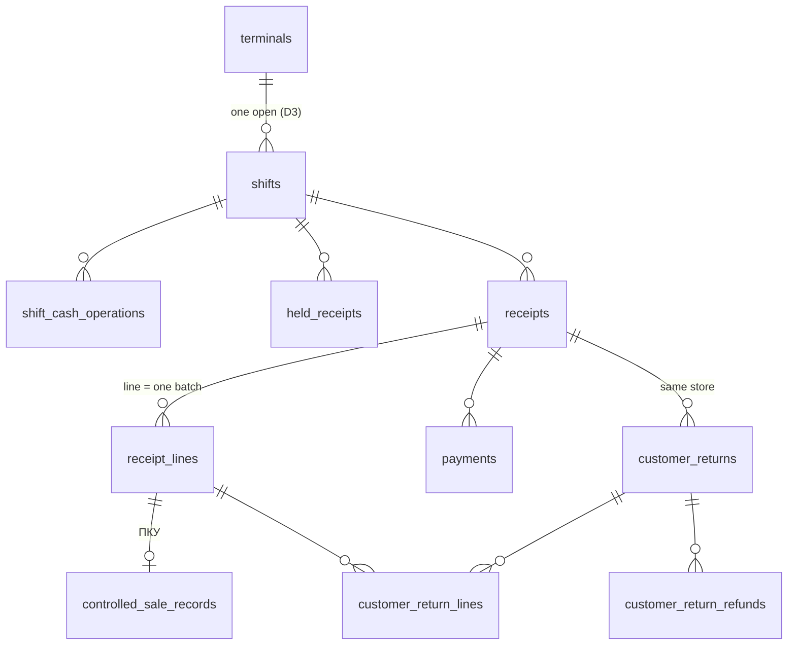

# 4. Касса

Соглашения — в [README](README.md). `tenant_id`, `(tenant_id, id)` и `created_at` в списках колонок не повторяются.

Синхронизация всего раздела: на офлайн-точке — точка → облако. Операции: `shift.opened`, `shift.cash-collected`, `shift.closed`, `receipt.completed` (чек + строки + оплаты + движения + записи ПКУ + аудит), `return.completed`. `held_receipts` — локально.

## `shifts` — смена кассы (класс `tenant`, D3)

| Колонка | Тип | Правило |
|---|---|---|
| `store_id`, `terminal_id` | uuid | |
| `number` | text | Номер Z-отчёта из `document_counters` (`z_report`) |
| `status` | text | `open` / `closed` |
| `opened_by`, `opened_at` | | |
| `opening_cash_dirams` | bigint ≥ 0 | |
| `closed_by`, `closed_at` | null | |
| `expected_cash_dirams` | bigint null | Начало + наличные продажи − наличные возвраты + внесения − изъятия, при закрытии |
| `counted_cash_dirams` | bigint null | Пересчёт |
| `discrepancy_dirams` | bigint null | `counted − expected` |
| `discrepancy_reason` | text null | Обязательна при расхождении ≠ 0 |
| `z_report` | jsonb null | Снимок Z-отчёта при закрытии: выручка по способам оплаты, возвраты, число чеков — повторная печать совпадает |

На один терминал — не больше одной смены `open` (уникальный частичный индекс `(tenant_id, terminal_id) where status = 'open'`).

## `shift_cash_operations` (класс `tenant`, только добавление)

`shift_id`, `kind` — `deposit` / `withdrawal`, `amount_dirams > 0`, `reason text`, `employee_id`, `occurred_at`.

## `held_receipts` — отложенный чек (класс `tenant`, локально)

`store_id`, `shift_id`, `held_by`, `held_at`, `payload jsonb` (строки, выбранные партии, скидка), `label text null`. Виден кассирам точки. Удаляется при оплате (становится `receipts`), отмене или закрытии смены (КП 5). Это единственная таблица кассы, где разрешён `DELETE`.

## `receipts` — оплаченный чек (класс `tenant`)

| Колонка | Тип | Правило |
|---|---|---|
| `store_id`, `terminal_id`, `shift_id` | uuid | Смена обязательна и открыта (БЛ 6.2) |
| `cashier_id` | uuid | Сотрудник PIN-сессии |
| `number` | text | Уникален в `(tenant_id, store_id, number)`; счётчик `receipt` |
| `sold_at` | timestamptz | |
| `business_date` | date | |
| `subtotal_dirams` | bigint | Сумма строк до скидки |
| `discount_rule_id` | uuid null | |
| `discount_percent_bp` | integer default 0 | |
| `discount_dirams` | bigint default 0 | |
| `total_dirams` | bigint | `subtotal − discount`; `check` |
| `change_dirams` | bigint default 0 | Сдача, только с наличной части |
| `status` | text | `paid` / `partially_returned` / `returned` |
| `operation_id` | uuid | Ключ идемпотентности (UUIDv7 клиента); уникален в `(tenant_id, operation_id)` |
| `correlation_id` | text | |
| `origin` | text | `online` / `offline_buffer` (буфер перебоев облачной точки) / `offline_store` |
| `fiscal_status` | text | `not_required` / `pending` / `sent` / `failed` |
| `fiscal_data` | jsonb null | Реквизиты ККМ — после выбора вендора (stack.md № 9) |
| `language` | text | Язык напечатанного чека |

Индексы: `(tenant_id, store_id, business_date)`, `(tenant_id, shift_id)`. QR на чеке кодирует `id` чека — для поиска при возврате.

## `receipt_lines` (класс `tenant`)

Строка = **одна партия**. Если FEFO берёт товар из двух партий — две строки.

| Колонка | Тип | Правило |
|---|---|---|
| `receipt_id`, `line_no` | | |
| `product_id`, `batch_id` | uuid | Партия той же точки, не просрочена на момент продажи |
| `sale_unit` | text | `pack` / `piece` |
| `qty_pieces` | integer > 0 | |
| `unit_price_dirams` | bigint | Цена единицы продажи на момент продажи — чек не переоценивается |
| `line_amount_dirams` | bigint | |
| `discount_share_dirams` | bigint default 0 | Доля скидки чека (для возвратов и маржи) |
| `cost_dirams` | bigint | `qty_pieces × batches.cost_per_piece_dirams` — снимок для отчёта о марже |
| `batch_chosen_manually` | boolean | Кассир выбрал не FEFO (право `pos:choose-batch`) |

## `payments` (класс `tenant`)

`receipt_id`, `payment_method_id`, `kind` (снимок вида способа), `amount_dirams > 0`. Сумма оплат = `total + change`. Сдача только при наличной части: `check` на уровне чека проверяет приложение.

## `customer_returns`, `customer_return_lines`, `customer_return_refunds` (класс `tenant`)

**`customer_returns`:**
- `store_id`, `shift_id`, `terminal_id`, `cashier_id`;
- `receipt_id` — обязателен; ссылка `(tenant_id, store_id, receipt_id) → receipts (tenant_id, store_id, id)`, поэтому возврат на другой точке невозможен;
- `number` (счётчик `customer_return`), `returned_at`, `business_date`;
- `found_without_receipt boolean` — продажа найдена по товару и дате (право `returns:without-receipt`);
- `recalculated_discount_dirams`, `total_dirams`, `operation_id` (уникален), `correlation_id`, `reason_code null`.

**`customer_return_lines`:** `receipt_line_id`, `qty_pieces > 0`, `amount_dirams`. Сумма возвратов по строке ≤ проданному: проверка под блокировкой строки чека.

**`customer_return_refunds`:** `payment_method_id`, `amount_dirams` — теми же способами, что при оплате (КП 7).

**Правила:**
- возврат возможен в течение `tenant_settings.return_period_days` от `sold_at`;
- товар возвращается движением `customer_return` в партию строки чека;
- скидка пересчитывается по порогам от оставшейся суммы чека (вопрос 4).

## `controlled_sale_records` — данные рецепта ПКУ (класс `tenant`, только добавление)

`receipt_line_id` (уникален), `prescription jsonb` — поля от заказчика (вопрос 1), `recorded_by`, `recorded_at`.

**Журнал ПКУ** — отдельной таблицы нет. Это выборка: движения по товарам `is_controlled` за период по дням плюс записи рецептов. Поэтому журнал всегда сходится с движениями партий (БЛ W3-07). Данные рецепта не пишутся в логи и аудит (ADR-0014 §8).
