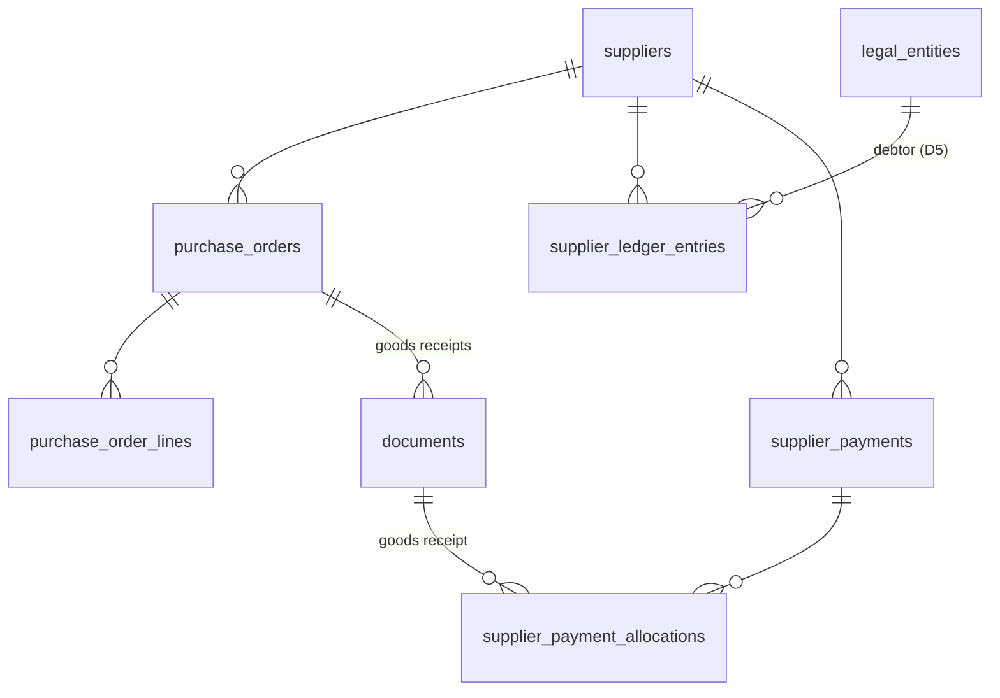

# 5. Закупки и поставщики

Соглашения — в [README](README.md). `tenant_id`, `(tenant_id, id)` и `created_at` в списках колонок не повторяются.

Владение данными офлайн-точки: `suppliers` — облако → точка. Заказы, оплаты и журнал расчётов ведутся **только в облаке**. Приход, проведённый на офлайн-точке, приходит `document.posted`, и облако заводит по нему долг (уточнить в ADR-0014).

## `suppliers` (класс `tenant`)

| Колонка | Тип | Правило |
|---|---|---|
| `name` | text | Не переводится |
| `tax_id` | text null | |
| `phone`, `email`, `address` | text null | |
| `bank_details` | text null | Вопрос 13 |
| `payment_term_days` | integer default 0 | Отсрочка по умолчанию |
| `status`, `archived_at` | | `active` / `archived` |
| `updated_at` | | |

## `purchase_orders`, `purchase_order_lines` (класс `tenant`)

**`purchase_orders`:**
- `store_id` — точка-получатель, `supplier_id`;
- `number` — счётчик `purchase_order`;
- `order_date`, `expected_date null`;
- `status` — `draft` → `confirmed` → `partially_received` → `closed`;
- `created_by`, `confirmed_by`, `confirmed_at`, `comment`.

Отдельная таблица, не тип `documents`: у заказа нет движений и свой набор статусов. «Отправить поставщику» (макет) — только печать или файл: канала отправки нет в закрытом списке интеграций.

**`purchase_order_lines`:** `product_id`, `qty_ordered_pieces > 0`, `price_per_pack_dirams`. Сколько получено, не хранится: считается по `goods_receipt_lines.purchase_order_line_id` проведённых приходов. Статус заказа обновляется при проведении прихода. «Заполнить по дефициту» — расчёт приложения по `store_products.min_stock_pieces` и расходу за 30 дней.

## `supplier_ledger_entries` — расчёты с поставщиком (класс `tenant`, только добавление)

Долг = сумма записей по паре «поставщик × юрлицо» (D5: должно юрлицо точки прихода).

| Колонка | Тип | Правило |
|---|---|---|
| `supplier_id`, `legal_entity_id` | uuid | |
| `kind` | text | `goods_receipt` (+), `payment` (−), `supplier_return` (−), `adjustment` (±), `reversal` |
| `amount_dirams` | bigint ≠ 0 | Знак по `kind` |
| `due_date` | date null | Для `goods_receipt` — срок оплаты документа |
| `source_type`, `source_id` | | Документ, оплата или корректировка |
| `business_date` | date | |
| `recorded_by`, `recorded_at` | | |

**Правила:**
- **проведение прихода** — запись `goods_receipt` на `documents.total_dirams`;
- **отмена проведения** — запись `reversal`;
- **возврат поставщику** — запись `supplier_return`: по исходному приходу, если он указан, иначе на самый ранний неоплаченный (через распределение).

## `supplier_payments`, `supplier_payment_allocations` (класс `tenant`)

**`supplier_payments`:**
- `supplier_id`, `legal_entity_id`;
- `amount_dirams > 0`, `paid_on date`;
- `method text` — `cash` / `bank_transfer`. Платит только бухгалтерия, не касса точки: связи со сменой и изъятием из кассы нет (решение 2026-10-01);
- `comment`, `created_by`.

Оплата создаёт запись `payment` в журнале.

**`supplier_payment_allocations`:** ключ `(tenant_id, payment_id, goods_receipt_document_id)`, `amount_dirams > 0`. Записывается в момент оплаты: по умолчанию — на самые ранние по сроку неоплаченные приходы, можно выбрать вручную. Нераспределённый остаток оплаты — предоплата: она автоматически распределяется на следующий проведённый приход этого поставщика и юрлица (решение 2026-10-01).

**Отчёты:**
- остаток по приходу = сумма прихода − распределённые оплаты − возвраты по нему;
- «просрочено» — остаток > 0 и `due_date` < сегодня (бизнес-дата сети);
- напоминание — за `tenant_settings.supplier_payment_reminder_days`;
- автоблокировок нет (КП 4).
