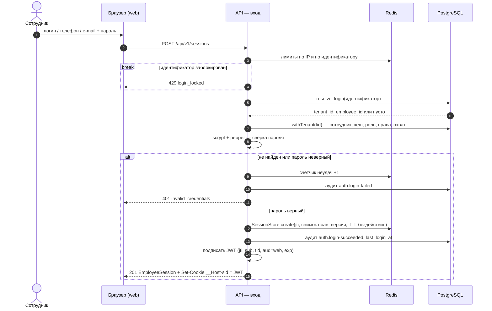
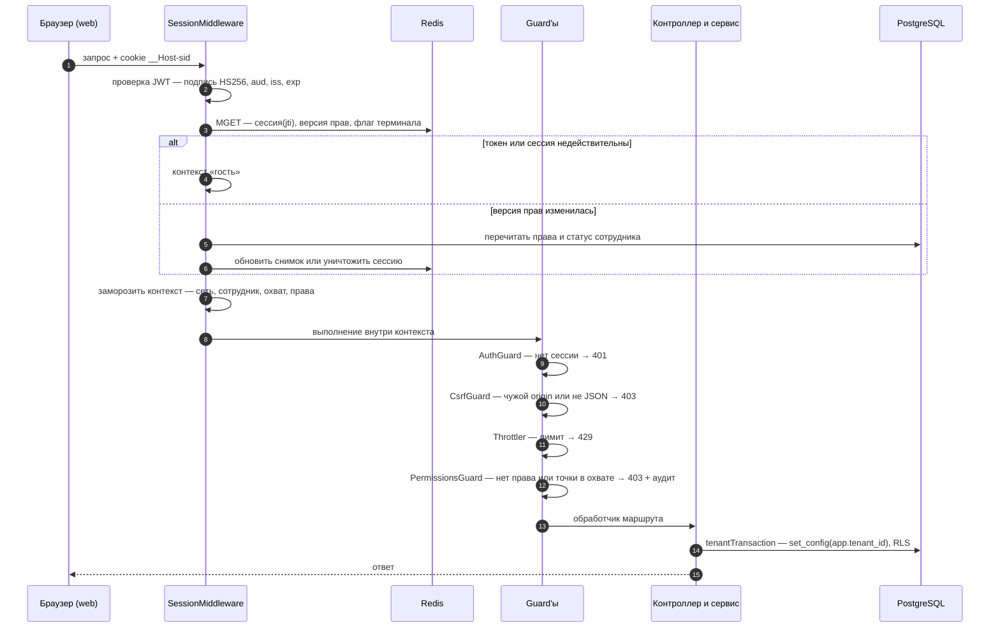
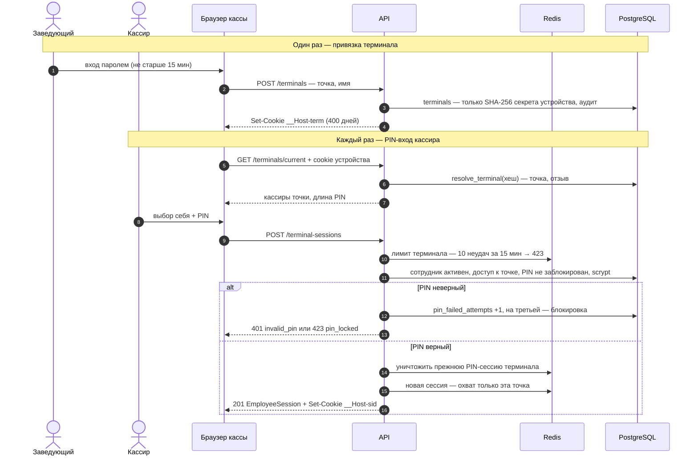
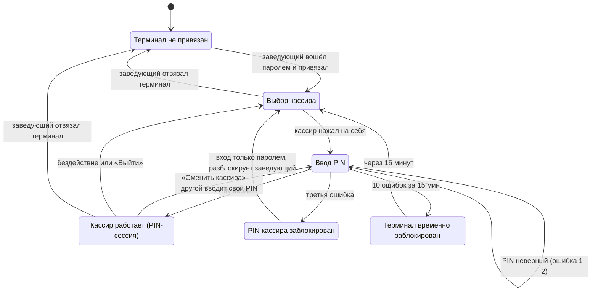

# Аутентификация и авторизация apps/api — дизайн

Дата: 2026-10-02. Статус: на утверждении архитектора (Zohid Saidov).
Основа: ADR-0008 (аутентификация), ADR-0013 (кросс-тенантный доступ), ADR-0014 (офлайн-точки),
ADR-0018 (авторизация), модель данных `docs/architecture/data-model/`, контракты фронтендов
`libs/shared/dto/src/lib/{tenant-auth,operator-auth,tenant-staff}.ts`, каталог прав
`libs/shared/domain/src/lib/permissions.ts`.

## 1. Цель и критерии успеха

web и admin сейчас работают на моках. Цель — настоящий вход и проверка прав в `apps/api`, на
которых строятся модули кассы, склада и закупок.

Успех:
- реальный API отвечает по маршрутам, которые уже ждут фронтенды: `POST /sessions`,
  `GET /sessions/current`, `PUT /sessions/current/store`, `DELETE /sessions/current`,
  `GET /terminals/current`, `POST /terminal-sessions`, `POST /operator/sessions` и т. д.;
- права проверяет только сервер: запрет по умолчанию, каталог ADR-0018, охват точек;
- отзыв терминала, блокировка сотрудника и смена роли действуют на следующем запросе;
- интеграционные и e2e-тесты покрывают изоляцию тенантов, лимиты входа и подделку токена.

## 2. Решения, принятые при обсуждении (2026-10-02)

| # | Вопрос | Решение |
|---|---|---|
| R1 | Объём | Одна спецификация на 4 части; план и реализация — по частям, начиная с части 1 |
| R2 | Как определяется сеть при входе | Логин, телефон и e-mail сотрудника **уникальны на всей платформе**; войти можно по любому из трёх. Форма и `EmployeeLoginRequest` не меняются |
| R3 | Человек в двух сетях | В MVP — разные учётные записи (во второй сети другой логин; телефон и e-mail там только как контакт). Переключение между сетями — отдельный ADR после MVP; ядро не должно ему мешать |
| R4 | Первый доступ владельца | Одноразовый код активации, который оператор видит один раз при создании сети и передаёт владельцу сам (SMS/e-mail интеграций нет) |
| R5 | Контекст запроса | Неизменяемый контекст собирает `SessionMiddleware` до guard'ов; guard'ы только решают (вариант B) |
| R6 | Токен сессии | **JWT через `@nestjs/jwt`** в HttpOnly-cookie + проверка серверной сессии на каждом запросе; формат пригоден для будущего мобильного клиента (`Authorization: Bearer`) |
| R7 | Вход «от имени» (ADR-0008 E2) | Исключён из этой спецификации: влияет на доверие клиентов, обсуждается отдельно (раздел 13) |

R2, R6, R7 меняют принятые документы — поправки в разделе 12, до кода соответствующей части.

## 3. Объём и порядок частей

| Часть | Содержание | Зависит от |
|---|---|---|
| 1. Ядро и вход по паролю (облако) | `PasswordHasher`, `SessionTokenService`, Redis, `SessionStore`, `SessionMiddleware`, guard'ы, `@RequirePermission`, вход/выход/выбор точки, `/me`, активация владельца, лимиты, `audit_log` | — |
| 2. Терминал и PIN | привязка и отвязка терминала, device-cookie, `GET /terminals/current`, PIN-вход, блокировки PIN, смена PIN | 1 |
| 3. Оператор платформы | `operators`, вход в админку, права оператора, `platform_audit_log`, команда создания первого оператора | 1 |
| 4. Офлайн-точка | `STORE_MODE=offline`, `PgSessionStore`, cookie без `__Host-`, первый вход по коду, команда кода при установке | 1, 2 |

Вне спецификации: управление сотрудниками и ролями (`tenant-staff.ts`, в т. ч. разблокировка PIN и
выдача кодов заведующим), переключение web/admin с моков на API, вход «от имени», мобильный
клиент, передача событий терминалов в синхронизацию (ADR-0014), доступ к офлайн-точке по LAN,
переключение между сетями.

## 4. Архитектура

```
apps/api/src/
├── core/
│   ├── crypto/        PasswordHasher (scrypt + HMAC-pepper, PHC, needsRehash),
│   │                  SessionTokenService (@nestjs/jwt, HS256, kid), self-check, randomToken(), sha256()
│   ├── redis/         RedisModule — the only node-redis client (cloud only)
│   └── sessions/      SessionStore port: RedisSessionStore (cloud) / PgSessionStore (offline)
├── common/
│   ├── context/       frozen RequestContext: correlationId, principal | null
│   ├── middleware/    CorrelationIdMiddleware, SessionMiddleware
│   └── guards/        AuthGuard (@Public), CsrfGuard, step-up (@RequireFreshAuth)
└── app/
    ├── auth/          sessions, activations, /me, PermissionsGuard + @RequirePermission, LoginResolver, limits
    ├── terminals/     part 2: binding, current terminal, PIN sessions
    ├── audit/         AuditService.append(trx, event) + audit_log
    └── platform/auth/ part 3: operators, OperatorPermissionsGuard + @RequireOperatorPermission
```

**Порты** (облако, офлайн-точка и будущие `accounts`/мобильный клиент подключаются без переделки
guard'ов и контроллеров):

| Порт | Назначение | Реализации |
|---|---|---|
| `PasswordHasher` | `hash`, `verify`, `needsRehash` для пароля и PIN (одноразовый код — не он: `sha256()`, раздел 6) | scrypt (`node:crypto`) |
| `SessionTokenService` | `sign(claims)`, `verify(token, audience)` | `@nestjs/jwt` |
| `TokenExtractor` | достать токен из запроса | cookie (web, admin); Bearer для `aud=mobile` — после ADR мобильного клиента |
| `SessionStore` | `create`, `get`, `touch`, `update`, `destroy`, `destroyAllFor(employee)`, `destroyForTerminal(terminal)` | Redis (облако), PostgreSQL (офлайн) |
| `PermissionsVersionCache` | текущая `permissions_version` сотрудника | Redis (облако), чтение `employees` (офлайн) |
| `LoginResolver` | идентификатор → `(tenantId, employeeId)` | резолвер `resolve_login` |

**Два контура принципала** (ADR-0013):

| | Сотрудник тенанта | Оператор платформы |
|---|---|---|
| Cookie | `__Host-sid` (офлайн — `sid`) | `__Host-op_sid` |
| `aud` JWT | `web` | `admin` |
| Маршруты | всё, кроме `/api/v1/operator/*` | только `/api/v1/operator/*` |
| Данные | `TenantDatabase` (RLS по `tid`) | `PlatformDatabase` |
| Права | каталог ADR-0018, `@RequirePermission` | права оператора в коде, `@RequireOperatorPermission` |

Контур выбирается по пути; токен чужого контура не принимается.

**Новые зависимости:** `redis` (node-redis 6), `helmet`, `@nestjs/throttler` — названы в ADR-0008;
`@nestjs/jwt`, `cookie-parser` — в поправку ADR-0008. Точные версии и лицензии проверяются при
добавлении (`npm view`), single-version policy Nx.

## 5. Токен и сессия

**JWT** (`@nestjs/jwt`, внутри `jsonwebtoken` v9):
- подпись `HS256`; при проверке строго `algorithms: ['HS256']`, `issuer`, `audience` — `alg: none` и
  подмена алгоритма невозможны;
- ключ — 256 бит; свой у облака и у каждой офлайн-точки; несколько ключей с `kid`
  (`secretOrKeyProvider`) — ротация без сброса сессий;
- claims — только идентификаторы: `jti` (UUID сессии), `sub` (сотрудник/оператор), `tid` (сеть;
  у оператора нет), `aud`, `iss` (`pharmacy-api`), `iat`, `exp` (абсолютный срок). Прав, охвата и
  персональных данных в токене нет.

**Запись сессии** (`SessionStore`, ключ — `jti`): `tenantId`, `employeeId`, `auth` (`password` |
`pin`), `authenticatedAt`, `permissions[]` (снимок), `permissionsVersion`, `storeScope`
(`all` | список), `currentStoreId`, `terminalId`, `terminalCredentialHash` (для PIN-сессии),
`locale`, `idleExpiresAt`, `absoluteExpiresAt`. В Redis — TTL = таймаут бездействия.

**Cookie:** `__Host-sid=<JWT>; Secure; HttpOnly; SameSite=Strict; Path=/; Max-Age=<абсолютный срок>`.
Новый `jti` и новая cookie — при входе, PIN-переключении и смене привилегий (защита от фиксации).

**Мгновенное действие изменений:** подпись JWT не заменяет серверную запись — отзыв, блокировка,
смена прав и уничтожение сессии действуют на следующем запросе (ADR-0008, ADR-0018 п. 7).

## 6. Вход по паролю (часть 1)

`POST /api/v1/sessions { login, password }` → 201 `EmployeeSession`.



1. Лимит по IP и маршруту — `@nestjs/throttler` с хранилищем на node-redis.
2. Нормализация идентификатора: содержит `@` → e-mail, `lower()`; `+` или только цифры → телефон в
   E.164 (9 цифр без кода страны → `+992…`); иначе — логин, `lower()`.
3. Счётчик неудач по нормализованному идентификатору (Redis): после `LOGIN_MAX_FAILURES` (5) —
   блокировка на `LOGIN_LOCK_SECONDS` (900), повторная — на 3600; ответ `429 login_locked`.
4. `LoginResolver` → резолвер `resolve_login(kind, value)` → `(tenant_id, employee_id,
   tenant_status)`. Нет совпадения — проверка против фиктивного хеша: ответ и время как при неверном
   пароле.
5. В `TenantDatabase.withTenant(tid)`: сеть `active`, сотрудник `active`, `password_hash` задан,
   scrypt совпал; `needsRehash` → перехеширование; загрузка прав роли (у роли-владельца — весь
   каталог), охвата, `permissions_version`; запись `last_login_at`.
6. Сессия: `currentStoreId` = единственная точка охвата, иначе `null` (web показывает выбор точки).
   TTL бездействия — `tenant_settings.cashier_session_idle_min`, зажатый в
   `[SESSION_IDLE_TIMEOUT_MIN_SECONDS, SESSION_IDLE_TIMEOUT_MAX_SECONDS]`; абсолютный срок —
   `SESSION_ABSOLUTE_TTL_SECONDS`.
7. Аудит `auth.login-succeeded` / `auth.login-failed` в `audit_log` сети без секретов; если сеть не
   определилась — только лог приложения.

**Прочие маршруты:**
- `GET /sessions/current` → `EmployeeSession`;
- `PUT /sessions/current/store { storeId }` — точка активна и в охвате, иначе 403; меняет
  `currentStoreId` в записи сессии;
- `DELETE /sessions/current` — уничтожает сессию, очищает cookie;
- `GET /me`, `PATCH /me { locale }`, `POST /me/password` (step-up; после смены — `destroyAllFor`,
  кроме текущей, и новая cookie). Неверный текущий пароль — `422 invalid_current_password` с
  `errors: [{ field: 'currentPassword', code: 'invalid_current_password' }]` (не 401: ADR-0015 отдаёт 401
  потере сессии, а клиент по нему уходит на вход). Попытки считает тот же `LoginLimiter`, ключ
  `password-change:<tid>:<eid>`, политика 5 попыток / 900 с, как у входа; пока блокировка — `429 login_locked`;
  счётчик сбрасывается, когда текущий пароль подтверждён (в том числе при успешной смене). Без этого
  лимита украденная свежая сессия подбирала бы пароль со скоростью throttler'а (300 в минуту).

**Активация и сброс пароля владельца:** `POST /api/v1/activations { login, code, newPassword }`
(`@Public`). Код — 128 бит из `randomBytes`, показывается оператору один раз, в
`employee_credentials.one_time_code_hash` — только hex SHA-256 (энтропия кода делает scrypt и pepper
лишними; как секрет терминала), срок `ACTIVATION_CODE_TTL_HOURS` (72); сверка — `timingSafeEqual`.
Код гасится в той же транзакции, где задаётся пароль; лимиты — как у пароля; ответ 204, затем
обычный вход. Оператор выдаёт код при создании сети и для сброса пароля владельца (часть 3);
`CreateTenantResponse` дополняется полем `activationCode` (поправка контракта).

## 7. Проверка каждого запроса (часть 1)



**`SessionMiddleware`** (на всех маршрутах):
1. `TokenExtractor` достаёт токен по контуру пути; токена нет → гость.
2. `SessionTokenService.verify` — подпись, `HS256`, `iss`, `aud` контура, `exp`; ошибка → гость.
3. Одним `MGET`: запись сессии, `PermissionsVersionCache`, для PIN-сессии — флаг отзыва терминала.
4. Нет записи → гость. Терминал отозван или хеш device-cookie ≠ `terminalCredentialHash` →
   уничтожить сессию, гость. Версия прав отличается → перечитать права, охват и статус в
   `withTenant`; сотрудник не `active` → `destroyAllFor`, гость; иначе обновить снимок.
5. Продлить бездействие не чаще раза в 60 с.
6. Собрать `RequestContext` (`Object.freeze`, вложенные массивы тоже) и выполнить запрос в
   `requestContextStorage.run(context, next)`. `requireTenantId()` и `TenantDatabase` не меняются.

Гостевой контекст не отклоняет запрос — решают guard'ы. На офлайн-точке шаг 3 — один запрос к
PostgreSQL в `withTenant(tid из токена)` (раздел 10).

**Guard'ы** (глобальные, порядок важен):
1. `AuthGuard` — без принципала `401 unauthenticated`, кроме `@Public()`.
2. `CsrfGuard` — для `POST/PUT/PATCH/DELETE`: при наличии `Sec-Fetch-Site` он равен `same-origin`,
   иначе `Origin` совпадает с `WEB_ORIGIN` (контур web) или `ADMIN_ORIGIN` (контур admin);
   `Content-Type: application/json`. Иначе `403 csrf_rejected`.
3. Throttler — по принципалу, для гостя — по IP.
4. `PermissionsGuard` — запрет по умолчанию: маршрут без `@RequirePermission` и без `@Public` → 403.
   Право есть в снимке; точка из `storeParam` / `storeQuery` / `storeBody` входит в охват (у
   PIN-сессии — только точка терминала). Отказ → `403 forbidden` + `audit_log` `access.denied`
   (право, точка).
5. `@RequireFreshAuth()` — сессия открыта паролем не раньше `STEP_UP_MAX_AGE_SECONDS` (900) назад,
   иначе `403 fresh_auth_required`. Применяется: привязка/отвязка терминала, сотрудники и роли,
   смена своего пароля и PIN.

`@RequirePermission(permission: Permission, scope?: { storeParam?; storeQuery?; storeBody? })` —
одна строка каталога ADR-0018. Правила режима поверх ролей (склад офлайн-точки из облака — только
чтение, ADR-0014) добавляются вместе с модулем склада, не здесь.

**Версия прав.** Сервисы, меняющие роль, её права, охват или статус сотрудника, в той же транзакции
увеличивают `employees.permissions_version` (для роли — у всех её сотрудников), а после коммита
пишут новую версию в Redis. Нет ключа в Redis → версия читается из БД и кладётся в кэш.

Запись версии в Redis везде одна и та же — Lua «записать, если больше» (`PermissionsVersionCache.
setIfGreater`): ключ пишется, только если его нет или хранится меньшая версия, и при каждой записи
срок жизни обновляется. Порядок писателей не важен: пост-коммитная запись `bump`, заполнение при
промахе кэша и посев при входе (вход кладёт версию, из которой построен снимок) никогда не откатывают
кэш назад. Срок жизни ключа `pv:<tid>:<eid>` — 300 с: потерянная пост-коммитная запись (сбой Redis)
стоит не больше пяти минут устаревшего кэша — ключ истекает, следующий запрос читает версию из БД и
заполняет его. Тем же сроком ограничено окно, в которое смена роли или блокировка не доходит до
живой сессии.

## 8. Терминал и PIN (часть 2)





**Привязка** — `POST /api/v1/terminals { storeId, name }`: `terminals:create`, `@RequireFreshAuth`,
точка в охвате и `kind = 'pharmacy'`. Секрет устройства — `randomBytes(32)`, в
`terminals.credential_hash` — SHA-256. Cookie `__Host-term` (`Secure; HttpOnly; SameSite=Strict;
Path=/; Max-Age` 400 дней). Если у браузера уже есть действующий терминал — он отзывается и
создаётся новая запись. Аудит `terminal.bound`. Ответ — `BoundTerminal`.

**Текущий терминал** — `GET /api/v1/terminals/current` (`@Public`, доступ по device-cookie):
SHA-256 cookie → резолвер `resolve_terminal(hash)` → `(tenant_id, store_id, terminal_id,
revoked_at)`; нет или отозван → `404 not_bound`. В `withTenant`: точка; кассиры — активные
сотрудники с доступом к точке и заданным PIN (`shortName` «Имя Ф.»); `pinLength` =
`tenant_settings.pin_min_length`. `last_seen_at` — не чаще раза в 5 минут.

**PIN-вход** — `POST /api/v1/terminal-sessions { employeeId, pin }` + device-cookie, проверки по
порядку:
1. терминал действителен (резолвер);
2. счётчик терминала в Redis: `TERMINAL_PIN_MAX_FAILURES` (10) неудач за
   `TERMINAL_PIN_WINDOW_SECONDS` (900) → `423 terminal_locked`;
3. сотрудник `active` и имеет доступ к точке терминала;
4. `pin_locked_at` не задан, иначе `423 pin_locked`;
5. scrypt PIN; ошибка → `pin_failed_attempts + 1` в `employee_credentials`, на третьей —
   `pin_locked_at = now()`, ответы `401 invalid_pin` / `423 pin_locked`; аудит `auth.pin-failed` /
   `auth.pin-locked`.

Успех: счётчик сбрасывается; уничтожаются прежняя PIN-сессия терминала (связь «терминал → `jti`» в
`SessionStore`) и сессия из cookie этого браузера, если была; новая сессия — `auth: 'pin'`,
`terminalId`, `terminalCredentialHash`, охват и рабочая точка — точка терминала, права — по роли,
бездействие — `cashier_session_idle_min`. Аудит `auth.pin-succeeded`. Ответ 201 `EmployeeSession`.

**Каждый запрос PIN-сессии** — флаг отзыва терминала и совпадение хеша device-cookie (раздел 7,
шаг 4): украденная cookie сессии без cookie устройства бесполезна.

**Отвязка** — `DELETE /api/v1/terminals/{id}`: `terminals:delete`, `@RequireFreshAuth`, точка в
охвате. `revoked_at`/`revoked_by`, флаг отзыва в Redis, `destroyForTerminal`. Аудит
`terminal.revoked`.

**Смена PIN** — `POST /api/v1/me/pin { currentPin, newPin }`: только сессия по паролю
(`@RequireFreshAuth`); длина ≥ `pin_min_length`; тривиальные PIN — `pin-policy` из
`libs/shared/domain` (`422 pin_trivial`); сброс счётчика и блокировки; аудит.

**Мои терминалы** — `GET /api/v1/me/terminals`: события аудита входа сотрудника на терминалах за
90 дней + `terminals`; отдельной таблицы нет, пока запрос не станет медленным.

## 9. Оператор платформы (часть 3)

- Таблицы класса `platform`: `operators` (`login` = рабочий e-mail, unique; `full_name`, `status`),
  `operator_credentials` (хеш пароля, версия pepper), `platform_audit_log` (только добавление).
  Доступ через `PlatformDatabase`; резолвер не нужен.
- Первый оператор — `node scripts/create-operator.mjs --login <e-mail> --name "<ФИО>"` в образе API;
  пароль вводится в консоли без эха, не аргументом. Остальные операторы — из админки позже.
- `POST /api/v1/operator/sessions { login, password }` → 201 `OperatorSession`; хеширование, лимиты,
  фиктивный хеш — как у сотрудника. Сессия в Redis, `aud=admin`, cookie `__Host-op_sid`,
  бездействие `OPERATOR_SESSION_IDLE_SECONDS` (1800), абсолютный срок
  `OPERATOR_SESSION_ABSOLUTE_SECONDS` (28800). `GET` и `DELETE /operator/sessions/current`.
- Права оператора — в коде: роль `full_access` (MVP), права `platform:*` / `tenants:*`;
  `OperatorPermissionsGuard` + `@RequireOperatorPermission` на `/operator/*`; step-up — для
  управления операторами и выдачи кода активации.
- `platform_audit_log`: вход, неудачи, блокировки, выдача кода активации.

## 10. Офлайн-точка (часть 4)

- `STORE_MODE=offline` выбирает адаптеры через DI: `PgSessionStore`, без Redis-модуля, throttler в
  памяти (один процесс, ADR-0008); маршруты `/operator/*` не регистрируются.
- Таблица `sessions` (класс `tenant`): ключ `(tenant_id, jti)`, `employee_id`, `terminal_id`,
  `auth_method`, `authenticated_at`, `idle_expires_at`, `absolute_expires_at`, снимок прав и версия.
  Поиск — в `withTenant(tid из JWT)` под RLS; в том же запросе — `employees.permissions_version`.
  Плановая задача удаляет просроченные. Резолвер `resolve_session` не нужен.
- Cookie `sid` и `term` (`Secure; HttpOnly; SameSite=Strict`; без `__Host-` — Chrome не принимает
  его на `http://localhost`).
- Ключ JWT и pepper точки (по 256 бит) генерируются при установке, хранятся в env-файле ПК точки, в
  облако не передаются; бэкап pepper — отдельно от БД.
- Учётные данные свои: `employee_credentials` не синхронизируется. Первый вход — код через
  `POST /api/v1/activations`; первый код при установке — `scripts/create-activation-code.mjs
  --login <логин>` (оператор); остальным — заведующий через модуль сотрудников (вне спецификации).
- Вход и PIN — те же потоки; `resolve_login` и `resolve_terminal` работают с локальной БД (одна
  сеть); счётчик неудач по идентификатору — в памяти, блокировка PIN — в `employee_credentials`.
- Изменения ролей и статуса приходят синхронизацией и меняют `permissions_version` — сессия
  обновится на следующем запросе; до синхронизации действуют прежние права (ADR-0018 п. 7).

## 11. Ошибки, конфигурация, безопасность

**Коды ошибок** (`application/problem+json`, поле `code`):

| Статус | Коды |
|---|---|
| 401 | `unauthenticated`, `session_expired`, `invalid_credentials`, `invalid_pin`, `invalid_code` |
| 403 | `forbidden`, `fresh_auth_required`, `csrf_rejected` |
| 404 | `not_bound` |
| 409 | `conflict` (пароль изменился параллельно при смене) |
| 422 | `password_policy`, `invalid_current_password`, `pin_trivial`, `pin_length` |
| 423 | `pin_locked`, `terminal_locked` |
| 429 | `login_locked`, `too_many_requests` |

Ответы не раскрывают, существует ли идентификатор и в какой он сети. Пароль, PIN, токены, коды,
pepper и ключи JWT — никогда в логах, аудите, URL и ответах.

**Конфигурация** (`env.validation.ts`, fail-fast):

| Переменная | По умолчанию | Примечание |
|---|---|---|
| `STORE_MODE` | `cloud` | `cloud` / `offline` |
| `REDIS_URL` | — | обязательна при `cloud` |
| `SESSION_JWT_KEYS`, `SESSION_JWT_ACTIVE_KID` | — | список `kid:base64url(32 байта)` |
| `PASSWORD_PEPPERS`, `PASSWORD_PEPPER_ACTIVE` | — | список `версия:base64url(32 байта)` |
| `SESSION_IDLE_TIMEOUT_MIN_SECONDS` / `_MAX_SECONDS` | 300 / 43200 | границы таймаута сети |
| `SESSION_ABSOLUTE_TTL_SECONDS` | 43200 | |
| `OPERATOR_SESSION_IDLE_SECONDS` / `_ABSOLUTE_SECONDS` | 1800 / 28800 | |
| `STEP_UP_MAX_AGE_SECONDS` | 900 | |
| `LOGIN_MAX_FAILURES`, `LOGIN_LOCK_SECONDS` | 5, 900 | повторная блокировка — 3600 |
| `TERMINAL_PIN_MAX_FAILURES`, `TERMINAL_PIN_WINDOW_SECONDS` | 10, 900 | |
| `ACTIVATION_CODE_TTL_HOURS` | 72 | |
| `WEB_ORIGIN`, `ADMIN_ORIGIN` | — | для CSRF |
| `TRUST_PROXY` | 0 | число reverse proxy перед API (`trust proxy`, 0–5; 0 — выключено); см. ниже |

**`TRUST_PROXY`** нужен всем ключам по IP (throttler гостя и входа, активация, `ip` в аудите входа): за
reverse proxy (ADR-0012) без него `req.ip` — адрес прокси, и все клиенты платформы делят один лимит.
Значение — реальное число прокси-узлов; больше — клиент подделывает `X-Forwarded-For`. Это
обязательная часть выкладки за reverse proxy.

Послабление cookie без `__Host-` и `Secure` для e2e — только при `APP_ENV=test`; в любой другой
среде процесс с ним не стартует.

**Самопроверка при старте** (ADR-0008): тест-вектор scrypt RFC 7914, наличие `crypto.scrypt` и
`timingSafeEqual`, длина ключей JWT и pepper ≥ 32 байт — иначе процесс не стартует.

## 12. Изменения данных и документов

**Миграции** (node-pg-migrate, только Up, классы — в `table-classes.ts`):

| Часть | Изменение |
|---|---|
| 1 | `employees`: `email text`, `last_login_at timestamptz`; глобальные уникальные индексы `lower(login)`, `phone` (E.164), `lower(email)` вместо `employees_login_uq (tenant_id, lower(login))`; `check` формата телефона; резолвер `resolve_login(kind text, value text)` (владелец `pharmacy_resolver`, `stable`, `set search_path = ''`, `EXECUTE` только `pharmacy_app`); `audit_log` с секционированием по месяцам (секции на 3 месяца вперёд + плановая задача) |
| 2 | резолвер `resolve_terminal(credential_hash bytea)` |
| 3 | `operators`, `operator_credentials`, `platform_audit_log` |
| 4 | `sessions` (только офлайн-точка) |

**Поправки** (раздел «Поправка 2026-10-02» в ADR + строка в `APPROVAL.md`; принимаются до кода
соответствующей части):
- **ADR-0008:** ось B — JWT через `@nestjs/jwt` в HttpOnly-cookie с проверкой серверной сессии,
  `HS256`, `kid`; `TokenExtractor` и задел под Bearer для мобильного клиента (сам клиент — отдельный
  ADR); `cookie-parser`; вход по глобально уникальному логину / телефону / e-mail; E2 «от имени» —
  решение пересматривается, не реализуется (раздел 13).
- **ADR-0013:** `resolve_login` вместо `resolve_tenant_by_code`; `resolve_session` не нужен.
- **Модель данных** (`01-platform-org.md`, `06-sync-audit-billing.md`): `employees.email`,
  `last_login_at`, глобальная уникальность; `tenants.code` не участвует во входе; ключ
  `sessions` — `(tenant_id, jti)`.
- **Контракты** (`libs/shared/dto`): `CreateTenantResponse.activationCode`; `ActivationRequest`;
  `email` в `CreateEmployeeRequest` / `TenantOwner` — необязательный.

После реализации каждой части: `CLAUDE.md` и `stack.md` (строки «Аутентификация», «Кэш / сессии»),
скил `nestjs-security-auth.md` (JWT, middleware-контекст, без «от имени»), глоссарий («Вход от
имени» — решение пересматривается).

## 13. Открытые вопросы

1. **Доступ оператора к данным сети** (вместо E2 ADR-0008) — отдельное обсуждение. Варианты:
   доступ только с согласия владельца на срок; без доступа к данным (только технические данные и
   витрины); код поддержки, который выдаёт владелец; текущая модель E2. Контракты
   `ImpersonationInfo` / `ImpersonationRequest` остаются в `libs/shared/dto`, API их не реализует;
   кнопку в админке — скрыть или отключить отдельной задачей.
2. **Переключение между сетями** — ADR после MVP (глобальные учётные записи, приглашение с
   подтверждением, сброс пароля общей учётной записи только оператором или самим человеком).
3. **Мобильный клиент** — ADR: Bearer, refresh-токен, привязка устройства, хранение токена.
4. **Хранилище секретов** (вопрос № 8 stack.md) — ключи JWT и pepper пока в env-файлах.

## 14. Тесты

**Unit** (Jest, `apps/api`):
- `PasswordHasher`: вектор RFC 7914, разбор и формирование PHC, `needsRehash` (параметры, версия
  pepper), неверный пароль, `timingSafeEqual`;
- `SessionTokenService`: принимает свой токен; отклоняет `alg: none`, `HS512`, токен, подписанный
  другим ключом, неизвестный `kid`, чужой `aud`, истёкший `exp`, изменённый payload;
- нормализация идентификатора: e-mail, телефон (`+992…`, 9 цифр, с пробелами и дефисами), логин;
- `CsrfGuard`: матрица `Sec-Fetch-Site` × `Origin` × метод × `Content-Type`;
- `PermissionsGuard`: запрет без декоратора, право есть/нет, охват из пути/query/тела, PIN-сессия
  вне точки терминала, аудит отказа;
- `SessionMiddleware`: гость при отсутствии/порче токена и отсутствии записи; перечитывание прав
  при новой версии; уничтожение при блокировке; контекст заморожен (запись бросает TypeError).

**Интеграционные** (`*.int-spec.ts`, `pharmacy_test`):
- резолверы по правилам ADR-0013 (каталог-тест): владелец `pharmacy_resolver`, `search_path`, нет
  `EXECUTE` у `PUBLIC`, результат — только идентификаторы и статус;
- глобальная уникальность логина / телефона / e-mail между двумя сетями;
- `audit_log`: `UPDATE`/`DELETE` от `pharmacy_app` падают; секция текущего месяца существует;
- `PgSessionStore`: сессия сети A не видна в контексте сети B;
- рост `permissions_version` при изменении роли.

**e2e** (`apps/api-e2e`, PostgreSQL + Redis):
- вход по логину, телефону и e-mail → выбор точки → защищённый маршрут;
- 401 без cookie, 403 без права и вне охвата;
- CSRF: чужой `Origin` и тело формы отклоняются;
- после `DELETE /sessions/current` старый JWT не работает;
- блокировка сотрудника и смена роли действуют на следующем запросе;
- 5 неудачных входов → `429 login_locked`;
- активация владельца кодом, повторное использование кода отклоняется;
- подменённый JWT отклоняется;
- часть 2: привязка, 3 неверных PIN → `423 pin_locked`, 10 по терминалу → `423 terminal_locked`,
  отвязка убивает PIN-сессию, cookie сессии без cookie устройства не работает;
- часть 3: вход оператора, tenant-токен на `/operator/*` и operator-токен на tenant-маршрутах
  отклоняются;
- часть 4: тот же набор в режиме `offline` без Redis.

Прогон на Node 22 и 24 — вручную (`npm run check`), пока CI отложен.

## 15. На что смотреть ревьюеру

1. Нет пути к данным тенанта без `tid` из проверенного JWT и серверной записи сессии.
2. Резолверы — только точное равенство, только идентификаторы; `pharmacy_app` не получает списков.
3. JWT проверяется со строгим списком алгоритмов, `aud` контура и `exp`; права в токене не лежат.
4. Ни один секрет не попадает в лог, аудит, URL, ответ об ошибке.
5. Ответы входа не различают «нет такого логина» и «неверный пароль» ни по коду, ни по времени.
