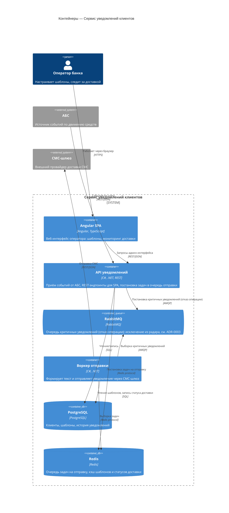

# C4 — Container: Сервис уведомлений клиентов

## Легенда

- **Angular SPA** — единственный пользовательский интерфейс сервиса, доступен только оператору банка.
- **API уведомлений** — точка входа для событий АБС и для SPA; сам не отправляет уведомления, а ставит задачи в очередь (Redis).
- **Воркер отправки** — отдельный процесс, читает очередь задач и вызывает СМС-шлюз; разделён с API по стилю «модульный монолит» (см. ADR-0002).
- **RabbitMQ** — отдельная очередь только для критичных уведомлений (отказ операции); одноразовое исключение из радара, см. ADR-0003; не расширять на другие сценарии.
- Технологии контейнеров соответствуют stack.md, раздел «3. Выбор стека», включая исключение RabbitMQ по ADR-0003; других технологий в контейнерах нет.
