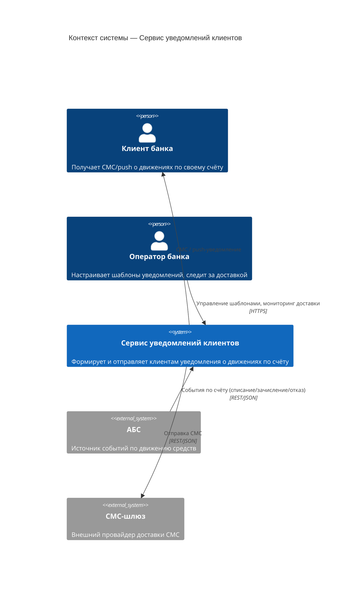

# C4 — Context: Сервис уведомлений клиентов

## Легенда

- **Клиент банка** — получатель уведомлений; сам с системой не взаимодействует, только получает СМС/push.
- **Оператор банка** — единственный пользователь веб-интерфейса сервиса: настраивает шаблоны текстов и наблюдает за статусами доставки.
- **АБС** — внешняя система-источник; присылает события по счёту через утверждённый API-слой, прямого доступа к её БД нет.
- **СМС-шлюз** — внешний провайдер связи; получает только номер телефона и текст уведомления, доступ — через DMZ-прокси (см. deployment.md).
- Все внешние системы совпадают со списком в stack.md, раздел «4. Интеграции».
